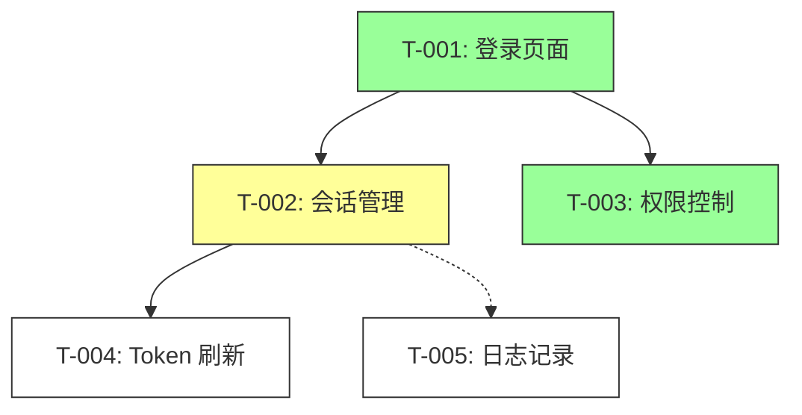

# AI 交接记录 · AI Handover Records (v4.1)

> **多 Agent 协作的完整协调层** · 确保任何 AI 接手后能在 **1 分钟内** 了解项目全貌

**核心升级**：v4.1 引入 IRON RULE 强制合规系统 + 调用方拒绝协议 + 跨任务交接链 + 并行 Agent 协调。v4.0 将交接记录从"单会话时间戳记录"升级为"多 Agent 协作的完整协调层"。
- YAML Frontmatter 结构化（机器可解析）
- 三层记忆（Wiki / Agents / Messages）
- Lane 状态机（明确状态转换 + Review 门控）
- Git Trailers 协议（决策可追溯）
- Slack/Discord 消息中继（可选）

---

## 📌 目录

1. [P0 强制触发](#-p0-强制触发)
2. [IRON RULE 系统（强制合规）](#-iron-rule-系统强制合规)
3. [YAML Frontmatter Schema — 机器可解析](#-yaml-frontmatter-schema--机器可解析)
4. [三层记忆架构](#-三层记忆架构)
    - 3.1 [Wiki 层 — User Memory（显式知识）](#31-wiki-层-user-memory显式知识)
    - 3.2 [Agent 层 — Agent Memory（学习沉淀）](#32-agent-层-agent-memory学习沉淀)
    - 3.3 [Messages 层 — Cross-Agent 消息](#33-messages-层-cross-agent-消息)
5. [跨任务交接链](#-跨任务交接链)
6. [Lane 状态机](#-lane-状态机)
7. [并行 Agent 协调](#-并行-agent-协调)
8. [Git Trailers 协议](#-git-trailers-协议)
9. [参数系统](#-参数系统)
10. [智能识别](#-智能识别)
11. [模块选择矩阵](#-模块选择矩阵)
12. [模板库](#-模板库)
13. [执行流程](#-执行流程)
14. [Slack/Discord 消息中继（可选）](#-slackdiscord-消息中继可选)
15. [特殊场景处理](#-特殊场景处理)
16. [反模式（禁止操作）](#-反模式禁止操作)
17. [平台兼容性](#-平台兼容性)
18. [变更记录](#-变更记录)

---

## 🔴 P0 强制触发

🔴 **AI agent 完成任务后必须立即撰写交接记录，这不是"建议"而是 P0 铁律。**

| 规则 | 说明 | 违反后果 |
|------|------|---------|
| 🔴 必须写交接记录 | 完成任务后必须在 `AI交接记录/` 目录创建执行记录 | 视为任务未完成，调用方有权拒收 |
| 🔴 必须实际写文件 | 禁止仅在对话中输出 Markdown 而不写文件 | 视为任务未完成 |
| 🔴 返回结果必须含路径 | 执行方返回给调用方的结果中必须包含交接记录路径引用 | 调用方不得标记任务完成 |
| 🔴 调用方必须验证 | 调用方收到执行结果后必须检查交接是否完整 | 缺一不可，缺失则责令补写 |

### 多 Agent 协作强制流程

```
执行方完成任务 → 写 AI交接记录/<timestamp>_<task>/ 执行记录.md
                                      ↓
                 更新 AI交接记录/lanes/active.md (状态机)
                                      ↓
                 写入 AI交接记录/messages/inbox.jsonl (通知)
                                      ↓
                 返回给调用方（含路径引用）
                                      ↓
                 调用方验证交接完整性 → 通过 → 标记任务完成
                                      ↓ (不通过)
                           责令执行方补写后再标记完成
```

### 执行方返回结果格式

```markdown
[任务完成报告]
- **AI交接记录**: AI交接记录/2026-06-26_143052_user-auth/
- **Agent ID**: coder@build
- **Lane Status**: in-progress → needs-review
- **Messages**: messages/inbox.jsonl (1 条新通知)
- **关键操作摘要**: [做了什么]
- **遗留问题**: [如有]
```

### 调用方验证责任（4 项）

收到执行方返回后，调用方必须检查以下 **4 项**：

1. ✅ `AI交接记录/` 目录下是否存在对应任务目录
2. ✅ 是否写入了 `执行记录.md` 文件（含 YAML frontmatter）
3. ✅ `AI交接记录/索引.md` 是否已更新
4. ✅ `AI交接记录/lanes/active.md` 状态是否已更新

如有缺失，**必须责令执行方补写后再标记任务完成**，不得跳过。

### 统一失败模式 if-then 表

| 触发条件 | 一线修复 | 仍失败兜底 |
|---------|---------|-----------|
| 执行方返回空结果 | 重新委托（简化 prompt） | 换执行方类型 |
| 执行方返回错误 | 读取错误信息 → 重新委托 | 换执行方 → 升级 |
| 执行方部分完成 | 补委托另一个 agent | 升级 |
| 连续 2 次失败 | 换执行方类型 | 请求用户介入 |
| 交接记录缺字段 | 责令执行方补写（参考 YAML Schema） | 调用方补委托 |
| 索引未更新 | 责令执行方更新 | 调用方补委托 |
| 文件夹命名错误 | 责令执行方重命名 | 调用方补委托 |
| Lane 状态跳转非法 | 责令执行方回退到合法状态 | 人工介入 |
| 消息队列堵塞 | 检查 inbox.jsonl 格式 | 归档后重新发送 |

---

## 🔴 IRON RULE 系统（强制合规）

🔴 **以下规则是铁律级约束。任何 Agent 违反任一 IRON RULE，调用方（build/orchestrator）有权直接拒收其输出，视为任务未完成。**

### IRON RULE #1: 强制写交接记录

🔴 每完成一个独立任务，必须立即写 AI交接记录。不写 → 调用方直接拒收，视为任务未完成。没有例外。

| 场景 | 规则 | 违反后果 |
|------|------|---------|
| 完成一个功能/修复 | 必须创建 `执行记录.md` + 更新索引 | 任务标记为未完成 |
| 完成一个子任务（如 review）| 必须写 review 交接记录 | review 视为无效 |
| 会话结束前 | 当前对话所有产出未记录时强制写 | 会话关闭时自动标记失败 |
| 用户说"记录/交接" | 用户显式要求时必须写 | 无视视为违规 |

### IRON RULE #2: 模板格式强制

🔴 执行记录必须使用 YAML frontmatter + Markdown 正文格式（双轨制）。禁止：省略必填字段、修改字段名、添加自定义字段。

```
✅ 必填的 YAML 字段（不可省略）：
  handover_id, prev_handover_id, agent_id, agent_role, coding_agent,
  model, status, branch, files_modified, verification, next_action, lock_files
❌ 禁止：用 Markdown 表格代替 YAML frontmatter
❌ 禁止：添加自定义字段（如 "my_custom_field"）
✅ 推荐：Markdown 正文可自由发挥（供人类阅读）
```

### IRON RULE #3: Git trailers 强制

🔴 git commit 必须包含 Coding-Agent + Model + Handover-Id 三个 trailers。缺少任一 → git commit 未完成，回到 working tree 补加。禁止：使用 Co-authored-by 代替 Coding-Agent + Model。

```git
# ✅ 正确格式
feat(auth): add session timeout

Handover-Id: 2026-06-26_143052_user-auth
Coding-Agent: OpenCode v1.2.3
Model: claude-opus-4-6
Constraint: must not break mobile refresh flow

# ❌ 禁止格式
Co-authored-by: Claude <noreply@anthropic.com>
```

### IRON RULE #4: 交接链强制

🔴 prev_handover_id 必须填写。如果是项目首次记录，填写 "init"。不填 → 调用方判断链断裂，责令补充后重新提交。

```
✅ Task A → handover_id: "2026-06-26_143052_user-auth" / prev_handover_id: "init"
✅ Task B → handover_id: "2026-06-26_150123_review" / prev_handover_id: "2026-06-26_143052_user-auth"
❌ "prev_handover_id 忘了"
```

### IRON RULE #5: 串行状态门控

🔴 串行任务必须经过 in-progress → needs-review → ready-for-merge → resolved。跳过 needs-review → 调用方拒绝，回退到 needs-review。禁止直接从 in-progress 跳到 resolved。

### IRON RULE #6: 并行文件锁

🔴 并行 Agent 必须声明文件锁。修改共享文件前先获取锁，完成后释放。写同一文件 = 冲突，后到者等待。禁止两个 Agent 同时写同一文件不同部分。

### IRON RULE #7: hot.md 强制更新

🔴 每次交接后必须更新 AI交接记录/wiki/hot.md。未更新 → 调用方责令补写，不补 = 任务未完成。

### IRON RULE #8: 新 Agent 入职流程

🔴 新 Agent 进入项目后，第一步必须顺序执行以下操作，未完成就动手视为违规：
1. 读 `AI交接记录/wiki/hot.md` — 了解当前热状态
2. 读 `AI交接记录/索引.md` — 了解项目总览
3. 读 `.ai-handover/locks/` — 检查文件锁状态
4. 读 `AI交接记录/lanes/active.md` — 了解当前活跃任务

### 调用方拒绝协议

🔴 **子 Agent 返回的结果如果不含完整交接记录，调用方必须拒绝，不能自行补写。**

```
收到子 agent 返回 → 检查 5 项（比原来 3 项扩展）：
1. ✅ AI交接记录/ 目录是否存在对应任务目录
2. ✅ 执行记录.md 是否存在且包含 YAML frontmatter（所有必填字段）
3. ✅ AI交接记录/索引.md 是否已更新
4. ✅ AI交接记录/lanes/active.md 状态是否已更新
5. ✅ IRON RULE #1-#9 是否遵守（有交接记录、格式正确、trailers 完整、链完整、状态门控、文件锁、hot.md 更新、入职流程、分支策略）

全部通过 → 标记任务完成
任一不通过 → 🔴 拒绝，将不通过项列表返回子 agent 责令补写
子 agent 修补后重新提交 → 再次验证
连续 2 次拒绝 → 换子 agent 类型，原任务标记失败
```

---

## 📋 YAML Frontmatter Schema — 机器可解析

**v4.1 核心升级**：`执行记录.md` 采用双轨制——YAML frontmatter（机器可解析）+ Markdown 正文（人类可阅读）。新增必填字段 prev_handover_id、lock_files、next_action。

### 完整 Schema

```yaml
---
# === Agent 身份 ===
handover_id: 2026-06-26_143052_user-auth   # 唯一 ID：<日期>_<时间>_<任务简述>
prev_handover_id: init                       # 前一个交接 ID，首次填 "init"
agent_id: coder@build                         # Agent 唯一标识：<角色>@<会话>
agent_role: worker                            # 枚举：primary / orchestrator / worker / reviewer / validator
coding_agent: OpenCode v1.2.3                 # 工具层
model: claude-opus-4-6                        # 模型层

# === 任务标识 ===
task_id: T-2026-06-26-001                     # 任务编号（可选，推荐时间序）
parent_plan: user-auth-feature                # 父任务/计划（可选）
task_type: feature                            # 枚举：feature / fix / refactor / docs / research / review
handover_type: handover                       # 枚举：handover / progress / decision

# === 状态机 ===
status: completed                             # 枚举：idle / in-progress / needs-review / ready-for-merge / resolved / blocked
previous_status: in-progress                  # 上一个状态（审计用）
branch: feat/user-auth                        # 当前分支
commit: abc123def                             # 最新 commit hash
duration_s: 1234                              # 耗时（秒）

# === 变更证据 ===
files_modified:                               # 修改的文件列表
  - src/auth/login.ts
  - src/auth/session.ts
  - src/auth/__tests__/session.test.ts
files_added: []                               # 新增文件
files_deleted: []                             # 删除文件
lock_files:                                    # IRON RULE #6: 文件锁列表
  - .ai-handover/locks/src-auth-session.json
verification:                                 # 验证结果 [命令]:[状态]
  - "npm test -- --grep session:pass"
  - "tsc --noEmit:pass"
  - "npm run lint:pass"

# === 风险与后续 ===
risks:                                        # 已知风险
  - level: low
    description: "cold-start latency >500ms"
blockers: []                                  # 阻塞项
next_action: "@reviewer please review src/auth/session.ts:42-48"
confidence: high                              # 枚举：low / medium / high

# === 消息通知 ===
notify:                                       # 通知目标（可选）
  - to: "@reviewer"
    via: discord                              # 枚举：slack / discord / inbox
    message: "Session timeout fix ready for review"

# === 时间戳 ===
started_at: 2026-06-26T14:30:52-07:00
ended_at: 2026-06-26T14:51:26-07:00
---

# 用户认证 Token 刷新修复

## 执行摘要
...
```

### 字段说明

| 字段 | 必填 | 说明 |
|------|:----:|------|
| `handover_id` | ✅ | 全局唯一 ID，`<日期>_<时间>_<任务简述>` |
| `prev_handover_id` | ✅ | 前一个交接 ID，首次填 "init"（IRON RULE #4）|
| `agent_id` | ✅ | `角色@会话` 格式，如 `coder@build`、`reviewer@codex` |
| `agent_role` | ✅ | primary / orchestrator / worker / reviewer / validator |
| `coding_agent` | ✅ | 使用的 AI 工具（OpenCode / Claude Code / Cursor 等） |
| `model` | ✅ | 模型名称（claude-opus-4-6 / gpt-4o 等） |
| `task_id` | 🟡 | 推荐，跨任务关联 |
| `status` | ✅ | 当前 Lane 状态 |
| `files_modified` | ✅ | 至少 1 个 |
| `verification` | ✅ | 至少 1 个 |
| `next_action` | ✅ | 指定下一个 Agent 的动作（IRON RULE #2 强制）|
| `lock_files` | ✅ | 文件锁列表（IRON RULE #6 强制）|
| `confidence` | 🟡 | 对结果的信心度 |
| `notify` | 🟡 | 可选，多 Agent 通知 |

> 🔴 IRON RULE #2 强制：以下字段为必填，不可省略。
> handover_id, prev_handover_id, agent_id, agent_role, coding_agent, model, status, branch, files_modified, verification, next_action, lock_files

---

## 🧠 三层记忆架构

v4.1 引入三层记忆（借鉴 memwiki + mem0 + agent-work-mem），区分"显式知识"、"学习和沉淀"、"实时消息"。

```
AI交接记录/
├── 索引.md                        ← 现有（总入口）
├── 统计.md                        ← 现有（全局统计）
├── wiki/                          ← 🆕 Layer 1: User Memory（显式知识）
│   ├── hot.md                     ← 热缓存（先读）
│   ├── preferences.md             ← 用户偏好
│   ├── patterns.md                ← 跨项目模式
│   ├── decisions.md               ← ADR 决策记录
│   └── bugs.md                    ← 已知 bug
├── agents/                        ← 🆕 Layer 2: Agent Memory（学习沉淀）
│   ├── coder@build/
│   │   ├── profile.md             ← Agent 人格
│   │   └── history.jsonl          ← 学习记录
│   ├── reviewer@build/
│   └── researcher@build/
├── messages/                      ← 🆕 Layer 3: Cross-Agent 消息
│   ├── inbox.jsonl                ← 待处理消息
│   └── archive/                   ← 已处理归档
├── lanes/                         ← 🆕 Lane 状态机
│   ├── active.md                  ← 当前进度
│   └── reviews.md                 ← Review 队列
└── <timestamp>_<task>/            ← 现有（每次任务一个文件夹）
    ├── 执行记录.md                ← 升级：YAML frontmatter
    ├── verification.log           ← 🆕 验证日志
    └── messages.md                ← 🆕 消息记录
```

### 3.1 Wiki 层 — User Memory（显式知识）

Wiki 层存储跨任务的**长期知识**。新 Agent 进入项目后**必须先读 `wiki/hot.md`**。

#### 完整结构

| 文件 | 用途 | 维护频率 | 示例 |
|------|------|---------|------|
| `hot.md` | 热缓存，~500 词，先读 | 每次任务结束 | 当前阶段、关键决策、活跃文件 |
| `preferences.md` | 用户偏好 | 变更时更新 | 技术栈偏好、命名习惯、工具链 |
| `patterns.md` | 跨项目模式 | 发现新模式时 | API 设计模式、错误处理约定 |
| `decisions.md` | 架构决策记录（ADR） | 每次重大决策 | Lore 风格 trailers 全文 |
| `bugs.md` | 已知 bug 分类 | 发现时追加 | 复现步骤 + 临时绕过 |

#### `hot.md` 模板

```markdown
---
last_updated: 2026-06-26T15:00:00-07:00
updated_by: coder@build
---

# HOT — 当前热缓存

## 当前阶段
- **项目**: user-auth-feature
- **阶段**: implementation（完成 40%）
- **活跃 Agent**: coder@build（实现中）、reviewer@build（待唤醒）

## 活跃决策
- 认证方案：JWT + refresh token（否决了 session-only）
- Token 存储：Redis（否决了本地存储）
- API 风格：RESTful（否决了 GraphQL）

## 活跃文件
- `src/auth/login.ts` — 主要改动中
- `src/auth/session.ts` — 稳定，⚠️ 42-48 行有 Agent-Directive

## 已知坑
- 测试环境 Redis 需要 mock（见 wiki/bugs.md）
- CI 超时阈值 5min（低于预期 8min）

## 下一步
- [ ] reviewer 审查 src/auth/session.ts:42-48
- [ ] 合并后更新 hot.md
```

#### `decisions.md` 模板（Lore 风格）

```markdown
---
last_updated: 2026-06-26T14:30:00-07:00
updated_by: coder@build
---

# 架构决策记录

## ADR-001: JWT + Refresh Token 认证方案

- **日期**: 2026-06-26
- **Decision**: 采用 JWT（15min 过期）+ Refresh Token（7天过期）双 token 方案
- **Constraints**: 必须向后兼容 v1.x token 格式；不能引入新依赖
- **Rejected-Alternatives**:
  - Session-only 认证 | 无法支持移动端
  - OAuth 2.0 集成 | 超出本期范围
  - 单 JWT 长期有效 | 安全违规
- **Verification**: `npm test -- --grep auth` 全部通过
- **Agent-Directives**:
  - 不要修改 `src/auth/token.ts:generate()` 签名
  - refresh token 必须使用 secure cookie（非 localStorage）
- **Confidence**: high
- **Handover-Ids**: 2026-06-26_143052_user-auth, 2026-06-26_091500_auth-redesign
```

### 3.2 Agent 层 — Agent Memory（学习沉淀）

每个 Agent 有独立的 `profile.md`（人格 + 权威边界）+ `history.jsonl`（学习记录）。

#### `profile.md` 模板

```yaml
---
agent_id: coder@build
role: worker                                # primary / orchestrator / worker / reviewer / validator
created_at: 2026-06-01T00:00:00-07:00
last_active: 2026-06-26T15:00:00-07:00
total_sessions: 47
authority_boundaries:                       # 权威边界（OpenACCP 模式）
  can:
    - write_code
    - run_tests
    - edit_files_in_scope
    - create_handover_records
  cannot:
    - merge_to_main
    - delete_files
    - modify_rules
  scope: src/**
  requires_approval_for:
    - dependency_addition
    - api_change
  escalation_to: build
preferences:                                # 个性偏好
  language: TypeScript
  testing_framework: jest
  code_style: "strict camelCase + explicit types"
learned_lessons: 12
known_weaknesses:                           # 已知弱点（供 build 路由参考）
  - "不太擅长前端 CSS"
  - "需要 reviewer 检查安全边界"
---
```

#### `history.jsonl` 格式（append-only）

每行一个 JSON 对象，按时间排序：

```json
{"type":"lesson","key":"auth-jwt-ttl","insight":"JWT 15min + refresh 7day 经验证安全合规","confidence":"high","source":"T-2026-06-26-001","files":["src/auth/session.ts"],"timestamp":"2026-06-26T14:51:26-07:00","handover_id":"2026-06-26_143052_user-auth"}
{"type":"pattern","key":"error-handling-middleware","insight":"Express 错误处理统一用 asyncHandler 包裹，禁止 try/catch 散落各处","confidence":"medium","source":"T-2026-06-25-003","files":["src/middleware/error.ts"],"timestamp":"2026-06-25T16:30:00-07:00"}
{"type":"bug","key":"cold-start-latency","insight":"测试环境 Redis mock 启动耗时 >500ms，需预热","confidence":"high","source":"T-2026-06-24-002","files":["test/setup.ts"],"timestamp":"2026-06-24T10:15:00-07:00","workaround":"在 jest 全局 setup 中预热 Redis mock"}
{"type":"preference","key":"code-style","insight":"用户偏好 type 而非 interface（受 TS 官方影响）","confidence":"high","source":"user-feedback","files":[],"timestamp":"2026-06-20T09:00:00-07:00"}
```

**字段说明**：

| 字段 | 必填 | 说明 |
|------|:----:|------|
| `type` | ✅ | lesson / pattern / bug / preference / decision |
| `key` | ✅ | 唯一标识，用于去重 |
| `insight` | ✅ | 学习内容，可操作 |
| `confidence` | ✅ | low / medium / high |
| `source` | 🟡 | 来源任务 ID |
| `files` | ✅ | 相关文件 |
| `timestamp` | ✅ | ISO 8601 |
| `handover_id` | 🟡 | 关联交接记录 |
| `workaround` | 🟡 | 临时绕过方案 |

### 3.3 Messages 层 — Cross-Agent 消息

跨 Agent 消息协议，基于 @mention + 5 条铁律（参考 mention-handoff-protocol + btrain）。

#### 5 条铁律

| # | 规则 | 说明 |
|:-:|:----|:-----|
| 1 | `@mention` = 任务触发器 | 仅在显式 @mention 时激活，无 ambient listening |
| 2 | 一次回复一轮 | 一次 @mention 一次回复，禁止来回辩论 |
| 3 | 人类门控每轮 | 人类审查后才进入下一轮，防止循环 |
| 4 | Agent 有专属 Lane | 每个 Agent 有专属域，跨域才发生交接 |
| 5 | 文件化产物 | Agent 间通过文件（非对话上下文）通信——可审计、可恢复 |

#### `inbox.jsonl` 消息格式

每行一个消息事件，append-only：

```json
{"msg_id":"m-001","type":"review_request","priority":"high","from":"coder@build","to":"reviewer@build","subject":"请审查 src/auth/session.ts:42-48","task_id":"T-2026-06-26-001","handover_id":"2026-06-26_143052_user-auth","branch":"feat/user-auth","files":["src/auth/session.ts"],"body":"Session timeout 实现已完成，重点检查 42-48 行的边界条件。\n下一 Agent 建议运行: `npm test -- --grep session`","created_at":"2026-06-26T14:51:26-07:00","status":"pending"}
{"msg_id":"m-002","type":"review_response","priority":"normal","from":"reviewer@build","to":"coder@build","subject":"审查通过，LGTM","task_id":"T-2026-06-26-001","handover_id":"2026-06-26_150123_review-session","branch":"feat/user-auth","files":[],"body":"审查通过。42-48 行逻辑正确，边界条件已覆盖。建议补充一个集成测试。","created_at":"2026-06-26T15:01:26-07:00","status":"resolved","in_reply_to":"m-001"}
```

**字段说明**：

| 字段 | 必填 | 说明 |
|------|:----:|------|
| `msg_id` | ✅ | 唯一 ID：`m-{数字}` |
| `type` | ✅ | review_request / review_response / blocker_raised / question / answer / status_report / proposal |
| `priority` | ✅ | blocking / high / normal / low |
| `from` / `to` | ✅ | Agent ID |
| `subject` | ✅ | 简短标题 |
| `task_id` | 🟡 | 关联任务 |
| `handover_id` | 🟡 | 关联交接 |
| `status` | ✅ | pending / in_progress / resolved / cancelled |
| `in_reply_to` | 🟡 | 回复链 |

#### 反循环控制

```
1. Max 1 response per @mention.
2. No responding to other agents' completions.
3. No spawning sub-agents in response to @mentions.
4. Timeout: 被 @mention 但不响应 > 30min → 通知人类。
5. Emergency stop: 任何人说 "stop" → 全部停止。
```

---

## ⛓️ 跨任务交接链

🔴 IRON RULE #4: 每个 handover 必须有 prev_handover_id。形成不可断裂的链。

### 链式结构

```
Task A → handover_id: "2026-06-26_143052_user-auth"
         prev_handover_id: "init"
         next_handover_id: "T-2026-06-26-002"
               ↓
Task B → handover_id: "2026-06-26_150123_review-session"
         prev_handover_id: "2026-06-26_143052_user-auth"
         next_handover_id: "T-2026-06-26-003"
               ↓
Task C → handover_id: "2026-06-26_160000_fix-auth-flow"
         prev_handover_id: "2026-06-26_150123_review-session"
```

### 链断裂处理

| 场景 | 断裂点 | 处理方式 |
|------|--------|---------|
| 项目首次 | prev_handover_id = "init" | 合法断裂——新起点 |
| 跨 Agent 链断裂 | prev_handover_id 指向不存在的 ID | 从 git log 恢复: `git log --grep="Handover-Id: xxx"` |
| 彻底断裂 | 无法恢复 | 记录到 `wiki/bugs.md`，标注「链断裂」|

### 跨任务状态恢复（IRON RULE #8）

新 Agent 按以下顺序恢复跨任务上下文：
```
1. cat AI交接记录/wiki/hot.md         # 读热缓存
2. cat AI交接记录/索引.md              # 读总览
3. git log --oneline -5               # 最新 5 个 commit
4. cat .ai-handover/locks/             # 读文件锁
5. cat AI交接记录/lanes/active.md      # 读活跃状态
6. cat AI交接记录/lanes/dependencies.md # 读依赖图（如有）
7. cat AI交接记录/messages/inbox.jsonl  # 读未处理消息
```

---

## 🔄 Lane 状态机

参考 btrain Lane State Machine + hisiling/agents-md SLA，提供明确的**任务生命周期**。

### 状态图

```
idle ─→ in-progress ─→ needs-review ─→ ready-for-merge ─→ resolved
 │                        │                  │
 ├──→ blocked             ├──→ changes-requested
 │     ↑                  │     ↓
 │     └── (人工介入)      └──→ in-progress (loop)
 │
 └──→ cancelled
```

### 状态说明

| 状态 | 描述 | 所有者 | 前置条件 | 后续状态 |
|------|------|:------:|---------|:--------:|
| `idle` | 已创建任务，未开始 | — | — | in-progress |
| `in-progress` | 执行中 | worker | 任务已分配 | needs-review / blocked |
| `needs-review` | 待审查 | reviewer | 所有验证通过 | ready-for-merge / changes-requested |
| `ready-for-merge` | 可合并 | primary | review 通过 | resolved |
| `resolved` | 完成 | — | 已合并 | — |
| `blocked` | 阻塞 | — | 无法继续 | in-progress / cancelled |
| `changes-requested` | 需要修改 | worker | review 未通过 | in-progress |
| `cancelled` | 取消 | — | 用户决定 | — |

### Lane SLA

| Event | SLA | 后果 |
|-------|:---:|:----:|
| Heartbeat | ≤ 60s 无进展报告 | Warn → 30s 后 Escalate |
| Idle reclaim | 120s 无进度 | 自动标记 blocked |
| Timeout | 30min 单任务硬上限 | 强制标记 blocked |
| Review turnaround | ≤ 15min | 超时 → 自动通过（可选）|

### `active.md` 模板

```yaml
---
updated_at: 2026-06-26T15:00:00-07:00
updated_by: coder@build
---

# Active Lane

## T-2026-06-26-001: 用户认证 Token 刷新

| 字段 | 值 |
|------|-----|
| Status | needs-review |
| Owner | coder@build |
| Reviewer | reviewer@build（待）|
| Branch | feat/user-auth |
| Started | 2026-06-26T14:30:52 |
| Duration | 20min |
| Blockers | 无 |

### 当前进展
- ✅ JWT 15min 过期逻辑
- ✅ Refresh token 自动刷新
- ✅ 测试覆盖率 92%
- ⏳ Review 待开始

### 下一步
1. reviewer 执行 review
2. 修复 reviewer 发现的问题
3. 合并到 main
```

### `reviews.md` 模板

```yaml
---
updated_at: 2026-06-26T15:00:00-07:00
---

# Review 队列

## 待 Review

| 任务 | 提交者 | 文件 | 等待时间 | 优先级 |
|------|-------|------|:-------:|:-----:|
| T-2026-06-26-001 | coder@build | src/auth/session.ts (42-48) | 0min | 🔴 high |

## 进行中

| 任务 | Reviewer | 开始时间 | 预计 |
|------|---------|:-------:|:----:|
| — | — | — | — |

## 已通过

| 任务 | Reviewer | 用时 | 结果 |
|------|---------|:---:|:----:|
| — | — | — | — |
```

---

## 🚀 并行 Agent 协调

### 6.1 文件锁机制（IRON RULE #6）

并行 Agent 通过 `.ai-handover/locks/` 完成文件级互斥。

**锁文件格式** `.ai-handover/locks/<encoded-file-path>.json`:

```json
{
  "held_by": "coder@build",
  "since": "2026-06-26T14:30:00-07:00",
  "task_id": "T-2026-06-26-001",
  "files": ["src/auth/session.ts"],
  "status": "in_progress",
  "heartbeat": "2026-06-26T14:45:00-07:00"
}
```

**锁规则**：

| 操作 | 行为 | 违反后果 |
|------|------|---------|
| 开始修改文件 | 先创建 lock.json | 无锁修改 → IRON RULE #6 违规 |
| 锁被占用 | 等待或换文件 | 强行写同一文件 → 冲突标记 |
| 修改完成 | 删除 lock.json | 不释放锁 → >30min 自动标记 warn |
| 死锁检测 | >30min 无 heartbeat | 标记 stale，通知调用方 |

### IRON RULE #9: 分支策略强制

🔴 **并行任务必须使用独立分支。** 每个并行 Agent 必须在独立分支上完成工作。

```
分支命名: agent-<agent_id>/<type>-<description>

✅ agent-coder@build/feat-session-timeout
✅ agent-coder2@build/fix-auth-cors
✅ agent-reviewer@codex/review-login

生命周期:
  start:    git checkout -b agent-<agent_id>/<feature> from main
  work:     多次 commit（每次含 Handover-Id trailer）
  review:   创建 PR → 指定 reviewer（通过 messages/inbox.jsonl）
  merge:    squash merge to main → 删除分支
  end:      更新 lanes/active.md → resolved
```

**分支隔离原则**：
- 每个 Agent 只能在自己的分支上操作
- 共享分支（main/develop）只能由 orchestrator 或 CI 写入
- 分支命名中的 agent_id 确保 `git branch` 一眼看出谁在做
- 合并前必须经过 review（needs-review 状态）

### 6.3 依赖图

新增 `AI交接记录/lanes/dependencies.md`（如涉及并行依赖）：

```yaml
---
updated_at: 2026-06-26T15:00:00-07:00
---

# 并行任务依赖图



## 活跃依赖

| 任务 | Agent | 依赖 | 被依赖 | 状态 | 阻塞 |
|------|-------|------|--------|------|:----:|
| T-004 | coder@build | T-002 | — | in-progress | ❌ 等待 T-002 完成 |
```

### 6.4 Git 事件 ↔ Lane 状态映射

| Git 事件 | Lane 状态变化 | 手动作业 |
|---------|-------------|---------|
| `git checkout -b agent-xxx/feat-y` | idle → in-progress | 写 lanes/active.md |
| `git commit` | 无变化 | 写 执行记录.md（包含 trailers）|
| `git push` | in-progress → needs-review | 写 messages/ 通知 reviewer |
| `gh pr create` | needs-review → ready-for-merge | 更新 lanes/reviews.md |
| `gh pr merge` | ready-for-merge → resolved | 更新索引 + hot.md |
| `git push origin --delete agent-xxx/feat-y` | — | 标记分支已清理 |

**跨会话恢复命令**：
```bash
# 找到所有与某 handover 关联的 commit
git log --grep="Handover-Id: 2026-06-26_143052_user-auth" --format="%H %s"

# 列出某 Agent 的所有 commit
git log --grep="Coding-Agent: OpenCode" --format="%H %s %(trailers:key=Handover-Id)"

# 查看当前文件锁
ls .ai-handover/locks/
```

---

## 🧬 Git Trailers 协议

v4.1 引入结构化 commit trailers（参考 Lore 论文 arXiv 2603.15566 + oh-my-claudecode + fabiorehm），使 **git log 成为 Agent 决策的可审计来源**。

### 标准 Trailers

```git
feat(auth): add session timeout

Implement 30-min idle session timeout to match security policy SEC-2024-12.

# === 标准 AI Trailers (ai-handover v4.1) ===
Handover-Id: 2026-06-26_143052_user-auth
Coding-Agent: OpenCode v1.2.3
Model: claude-opus-4-6
Coding-Agent-Role: worker

# === 决策 Trailers (Lore 模式) ===
Constraint: must not break mobile refresh flow
Constraint: existing Redis session store must be reused
Rejected-Alternatives: JWT-only validation | double cryptographic surface
Rejected-Alternatives: sliding-window extension | not compatible with SEC-2024-12
Agent-Directive: do not change the public session API
Agent-Directive: do not modify src/auth/session.ts:42-48

# === 验证 ===
Verification: integration test "session-timeout" passes in CI
Verification: npm test -- --grep session:pass

# === 范围 ===
Scope-Risk: narrow                         # narrow / moderate / broad
Confidence: high                           # low / medium / high
```

### Trailer 说明

| Trailer | 必填 | 说明 |
|---------|:----:|------|
| `Handover-Id` | ✅ | 关联交接记录 ID，`git log --grep="Handover-Id: <id>"` 可拉出所有关联 commit |
| `Coding-Agent` | ✅ | 使用的 AI 工具（替代 Co-authored-by）|
| `Model` | ✅ | 模型名称 |
| `Coding-Agent-Role` | 🟡 | worker / reviewer / primary |
| `Constraint` | 🟡 | 约束条件（可重复）|
| `Rejected-Alternatives` | 🟡 | 被否决方案 \| 否决理由（可重复）|
| `Agent-Directive` | 🟡 | 给后续 Agent 的指令（可重复）|
| `Verification` | 🟡 | 验证命令 + 结果 |
| `Scope-Risk` | 🟡 | 风险范围：narrow / moderate / broad |
| `Confidence` | 🟡 | 信心度：low / medium / high |

### 提交示例（完整流程）

```bash
# Agent 完成任务后
git add src/auth/session.ts src/auth/login.ts

# 使用标准 trailers 提交
git commit -m "feat(auth): add session timeout

Implement 30-min idle session timeout.

Handover-Id: 2026-06-26_143052_user-auth
Coding-Agent: OpenCode v1.2.3
Model: claude-opus-4-6
Constraint: must not break mobile refresh flow
Rejected-Alternatives: JWT-only validation | double crypto surface
Rejected-Alternatives: sliding-window | not compatible with SEC-2024-12
Verification: npm test -- --grep session:pass
Confidence: high"

# 然后写交接记录
# → AI交接记录/2026-06-26_143052_user-auth/执行记录.md
```

---

## 🎛️ 参数系统

v4.1 保留原有参数，新增 `coordination` 参数。

| 参数 | 说明 | 默认值 | 可选值 |
|------|------|:------:|--------|
| `type` | 记录类型 | handover | handover / progress / decision |
| `project_type` | 项目类型 | auto | auto / software / academic / docs / ops |
| `detail` | 详细程度 | full | full / summary / minimal |
| `coordination` | 协调模式 | auto | auto / solo / multi-agent |
| `output` | 输出格式 | markdown | markdown / json |

**coordination 参数**：
- `auto`：自动检测（检测到多 Agent 则启用完整协调层）
- `solo`：单 Agent 模式（标准交接，无消息/状态机）
- `multi-agent`：多 Agent 模式（完整协调层：wiki + agents + messages + lanes）

---

## 🧠 智能识别

本技能会自动从自然语言中推断参数，无需用户显式指定。v4.1 新增多 Agent 识别：

| 用户表述 | 推断参数 |
|---------|---------|
| "简单记一下" | type=handover, detail=summary |
| "详细记录" | type=handover, detail=full |
| "进度更新" | type=progress |
| "决策记录" | type=decision |
| "分派给 reviewer" / "通知 coder" | coordination=multi-agent |
| "多个 agent 协作" / "并行任务" | coordination=multi-agent |
| 提到 git/coding | project_type=software |
| 提到 paper/实验 | project_type=academic |
| 提到 deployment/配置 | project_type=ops |

---

## 📊 模块选择矩阵

v4.1 新增多 Agent 协作模块：

| 模块 | handover | progress | decision | summary | minimal | multi-agent |
|------|:--------:|:--------:|:--------:|:-------:|:-------:|:-----------:|
| 基本信息 | ✅ | ✅ | ✅ | ✅ | ✅ | ✅ |
| YAML Frontmatter | ✅ | ✅ | ✅ | ✅ | ✅ | ✅ |
| 执行过程 | ✅ | ✅ | ❌ | ✅ | ❌ | ✅ |
| 产出物 | ✅ | ✅ | ❌ | ✅ | ✅ | ✅ |
| 技术决策（Lore） | ✅ | ❌ | ✅ | ❌ | ❌ | ✅ |
| 环境信息 | ✅ | ❌ | ❌ | ❌ | ❌ | ✅ |
| Lane 状态 | 🟡 | ❌ | ❌ | ❌ | ❌ | ✅ |
| 消息队列更新 | 🟡 | ❌ | ❌ | ❌ | ❌ | ✅ |
| 遗留问题 | ✅ | ✅ | ❌ | ✅ | ❌ | ✅ |
| 下一步计划 | ✅ | ✅ | ❌ | ✅ | ❌ | ✅ |

> 🟡 = 仅在 coordination=multi-agent 时必填

---

## 📚 模板库

`references/templates/` 目录提供以下模板：

### 执行记录模板

| 模板 | 适用 | 格式 |
|------|------|:----:|
| `exec-record.md` | 通用（YAML frontmatter） | YAML + Markdown |
| `software.md` | 软件开发 | Markdown |
| `academic.md` | 学术研究 | Markdown |
| `docs.md` | 文档写作 | Markdown |
| `ops.md` | 运维部署 | Markdown |

### Wiki 层模板

| 模板 | 适用 |
|------|------|
| `wiki/hot.md` | 热缓存（先读） |
| `wiki/decisions.md` | 架构决策记录（Lore 风格） |
| `wiki/patterns.md` | 模式记录 |
| `wiki/preferences.md` | 用户偏好 |
| `wiki/bugs.md` | 已知 bug |

### Agent 层模板

| 模板 | 适用 |
|------|------|
| `agents/profile.md` | Agent 人格 + 权威边界 |
| `agents/history.jsonl` | 学习记录（append-only） |

### 消息协议模板

| 模板 | 适用 |
|------|------|
| `messages/handoff.md` | 跨 Agent 消息格式 |
| `messages/inbox.jsonl` | 消息队列格式 |

### Lane 模板

| 模板 | 适用 |
|------|------|
| `lanes/state.md` | Lane 状态机 + SLA |
| `lanes/active.md` | 当前活跃任务 |
| `lanes/reviews.md` | Review 队列 |
| `lanes/dependencies.md` | 依赖图 |

---

### Locks 层模板

| 模板 | 适用 |
|------|------|
| `locks/lock.json` | 文件锁格式 |

---

## 📋 执行流程

### 第一步：初始化目录结构（如果是首次使用或切换到多 Agent 模式）

```
AI交接记录/
├── wiki/
│   ├── hot.md
│   ├── preferences.md
│   ├── patterns.md
│   ├── decisions.md
│   └── bugs.md
├── agents/
│   └── <agent_id>/
│       ├── profile.md
│       └── history.jsonl
├── messages/
│   ├── inbox.jsonl
│   └── archive/
├── lanes/
│   ├── active.md
│   └── reviews.md
```

### 第二步：创建时间戳文件夹

```
AI交接记录/YYYY-MM-DD_HHmmss_任务简述/
```

**命名规则：**
- `YYYY-MM-DD`：完成日期
- `HHmmss`：完成时间（24小时制，精确到秒）
- `任务简述`：中文短描述（≤20字），用 `-` 连接多词

> 🔴 CHECKPOINT: 文件夹创建后，立即验证命名格式。格式错误 → 重命名后再继续。

### 第三步：编写执行记录（YAML Frontmatter + Markdown 正文）

参考 [YAML Frontmatter Schema](#yaml-frontmatter-schema-机器可解析) 填写。

> 🔴 CHECKPOINT: 执行记录写入后，立即检查：
> - YAML frontmatter 是否包含所有必填字段（handover_id / prev_handover_id / agent_id / agent_role / coding_agent / model / status / branch / files_modified / verification / next_action / lock_files）
> - Markdown 正文是否包含执行摘要 + 产出物
> - 遗留问题是否标记了 🔴🟡🟢
> 缺字段 → 补充后再继续。

### 第四步：更新 Lane 状态机

```markdown
# 更新 AI交接记录/lanes/active.md 中的状态
# 如果状态变化涉及 review → 更新 lanes/reviews.md
```

> 🔴 CHECKPOINT: 状态跳转是否合法？参考状态图。非法跳转 → 回退后继续。

### 第五步：消息通知（多 Agent 模式）

```markdown
# 将新的 @mention 消息 append 到 messages/inbox.jsonl
# 如果有 Slack/Discord webhook → 发送通知
```

> 🔴 CHECKPOINT: 消息格式是否包含所有必填字段？不完整 → 补充后再继续。

### 第六步：更新 Wiki 层（如果有新知识）

```markdown
# 更新 wiki/hot.md（热缓存）
# 如果有新决策 → 追加到 wiki/decisions.md（Lore 风格）
# 如果有新模式 → 追加到 wiki/patterns.md
# 如果有新 bug → 追加到 wiki/bugs.md
```

### 第七步：更新 Agent 记忆层

```markdown
# 追加一条学习记录到 agents/<agent_id>/history.jsonl
# 可选：更新 profile.md（如果偏好/边界变化）
```

### 第八步：更新索引

在 `AI交接记录/索引.md` 的**文件顶部**插入新条目。

> 🔴 CHECKPOINT: 新条目是否在顶部？路径是否正确？

### 第九步：Git 提交（可选但推荐）

```bash
git add <files_modified>
git commit -m "<type>(<scope>): <title>

<description>

Handover-Id: <handover_id>
Coding-Agent: <tool>
Model: <model>
Constraint: ...
Rejected-Alternatives: ...
Verification: ...
Confidence: <level>"
```

### 第十步：自检

| # | 检查项 | 通过标准 |
|:-:|:------|:--------|
| 1 | 文件夹命名 | 格式 `YYYY-MM-DD_HHmmss_中文简述`，精确到秒 |
| 2 | YAML frontmatter | 包含所有必填字段（handover_id / prev_handover_id / agent_id / agent_role / coding_agent / model / status / branch / files_modified / verification / next_action / lock_files） |
| 3 | 执行记录字段 | 按模块选择矩阵包含对应字段 |
| 4 | 索引已更新 | 新条目出现在索引文件顶部 |
| 5 | Lane 状态更新 | active.md 状态与实际匹配 |
| 6 | 消息队列更新 | inbox.jsonl 已写入（多 Agent 模式） |
| 7 | 遗留问题有严重度 | 每条遗留问题标记了 🔴/🟡/🟢 |
| 8 | 下步计划可执行 | 下一步计划是具体动作，非空泛描述 |
| 9 | Git commit（可选） | 含标准 trailers |

> 💡 亦可运行 `scripts/validate.sh` 自动验证所有检查项。

---

## 🔔 Slack/Discord 消息中继（可选）

v4.1 支持将 `messages/inbox.jsonl` 中的消息通过 webhook 推送到 Slack 或 Discord。

### 配置方式

在项目根目录创建 `.ai-handover.json`（可选，如不在则不启用中继）：

```json
{
  "version": "1",
  "webhooks": {
    "slack": "https://hooks.slack.com/services/xxx/yyy/zzz",
    "discord": "https://discord.com/api/webhooks/xxx/yyy"
  },
  "relay_rules": {
    "min_priority": "normal",
    "filter_types": ["review_request", "blocker_raised"]
  }
}
```

### 消息 → Webhook 映射

| 消息类型 | Slack 格式 | Discord 格式 |
|---------|-----------|-------------|
| `review_request` | `🔍 [高] @reviewer 请审查 <files>` | `🔍 @reviewer 审查请求` |
| `blocker_raised` | `🚫 [阻塞] <描述>` | `🚫 <描述>` |
| `status_report` | `📊 <进度>` | `📊 <进度>` |
| `proposal` | `💡 <建议>` | `💡 <建议>` |

### 发送格式

```json
{"msg_id":"m-001","type":"review_request","priority":"high","from":"coder@build","to":"reviewer@build","subject":"请审查 src/auth/session.ts","task_id":"T-2026-06-26-001","handover_id":"2026-06-26_143052_user-auth","branch":"feat/user-auth","files":["src/auth/session.ts"],"body":"Session timeout 实现已完成","created_at":"2026-06-26T14:51:26-07:00","status":"pending","webhook":"slack"}
```

---

## 🎯 特殊场景处理

### 场景 A：初次创建交接体系

如果项目的 `AI交接记录/` 目录不存在：
1. 创建 `AI交接记录/` 目录
2. 创建 `索引.md`
3. 按执行流程依次创建 wiki/、agents/（可选）、messages/（可选）、lanes/（可选）
4. 创建第一条执行记录

### 场景 B：项目还未完成

如果任务因中断而未完成：
- 执行记录中 `status` 标记为 `blocked`
- `blockers` 字段写明中断原因
- "下一步计划"的第一条是"从 [中断点] 继续"
- 更新 `lanes/active.md` 状态

### 场景 C：多项目并存

如果同时维护多个项目：
- 每个项目根目录下维护独立的 `AI交接记录/`
- 在 `说明文档.md` 中列出所有项目的路径
- 切换项目时同时切换对应的交接记录上下文
- `agents/` 可做符号链接到公共目录（需要用户确认）

### 场景 D：多 Agent 并行

如果多个 Agent 并行工作：
- 使用独立的 `task_id` 避免混淆
- 每个 Agent 在 lanes/active.md 中有独立条目
- 消息队列 `inbox.jsonl` 作为唯一通信渠道
- 写冲突时使用 commit hash + 验证字段自检
- 🔴 文件锁规则：一个文件同一时间只能被一个 Agent 写入

---

## 🚫 反模式（禁止操作）

| 禁止操作 | 正确替代 |
|----------|----------|
| ❌ 不写执行记录就切换任务 | ✅ 每个独立任务完成后立即记录 |
| ❌ 只更新执行记录不更新索引 | ✅ 两者同步更新，索引在顶部 |
| ❌ 遗留问题不标严重度 | ✅ 🔴🟡🟢 三级标记 |
| ❌ "下一步计划"写"继续开发" | ✅ 写具体动作："实现 POST /api/users" |
| ❌ 文件夹命名缺时间秒 | ✅ 完整 `HHmmss` |
| ❌ 无视降级策略导致空字段 | ✅ 标注「待补充」而非留空 |
| ❌ 关键任务无标签 | ✅ 添加 `#bug` `#feature` 等标签 |
| ❌ 仅在对话中输出 Markdown 不写文件 | ✅ 必须实际写入 `AI交接记录/` 目录 |
| ❌ 执行方返回结果不含交接记录路径 | ✅ 返回结果必须包含路径引用 |
| ❌ 调用方收到空/失败结果后自己动手修改 | ✅ 重新委托/简化重试/换执行方 |
| ❌ 多 Agent 模式下不用消息队列 | ✅ 所有跨 Agent 通信走 `messages/inbox.jsonl` |
| ❌ Lane 状态跳过 `needs-review` 直接到 `resolved` | ✅ 必须经过 review 门控 |
| ❌ 用 Co-authored-by 代替 Coding-Agent + Model | ✅ 使用标准 AI Trailers |
| ❌ git commit 不带 trailers | ✅ 附语义 trailers（Constraints / Verification 等）|
| ❌ 多 Agent 写同一文件 | ✅ 通过消息队列协调，一次一个 Agent 写 |
| ❌ YAML frontmatter 中跳过必填字段 | ✅ 必须包含 agent_id / status / verification / files_modified |
| ❌ 违反 IRON RULE #1 — 不写交接记录就切换任务 | ✅ 每个独立任务完成后立即记录，不写 = 任务未完成 |
| ❌ 违反 IRON RULE #2 — 省略 YAML frontmatter 必填字段 | ✅ 按 exec-record.md 模板逐字段填写 |
| ❌ 违反 IRON RULE #3 — commit 不用 Handover-Id trailer | ✅ 每个 commit 附 Coding-Agent + Model + Handover-Id |
| ❌ 违反 IRON RULE #4 — 不填 prev_handover_id | ✅ 链式引用，首次填 "init" |
| ❌ 违反 IRON RULE #5 — 跳过 review 直接到 resolved | ✅ 必须经过 needs-review 状态 |
| ❌ 违反 IRON RULE #6 — 不申请文件锁直接写文件 | ✅ 先创建 lock.json，完成后释放 |
| ❌ 违反 IRON RULE #7 — 不更新 hot.md | ✅ 每次交接后更新 hot.md |
| ❌ 违反 IRON RULE #8 — 新 Agent 不读 hot.md 直接动手 | ✅ 入职必须先读 hot.md + 索引.md |
| ❌ 违反 IRON RULE #9 — 并行任务不用独立分支 | ✅ agent-<agent_id>/<feature> 格式 |
| ❌ 调用方收到无交接记录的结果 → 自己动手补写 | ✅ 拒绝协议：返回不通过项，责令子 agent 补写 |
| ❌ 跨任务链断裂不修复 | ✅ 从 git log 恢复或标注「链断裂」|
| ❌ 两个 Agent 同时写同一文件 | ✅ 文件锁协调，后到者等待 |
| ❌ 用 Co-authored-by 对 AI commit 归因 | ✅ Coding-Agent + Model trailers |

---

## 🔧 平台兼容性

| 平台 | 安装路径 | 自动识别 | 消息中继 |
|------|---------|:--------:|:--------:|
| **OpenCode** | `~/.config/opencode/skills/ai-handover/` | ✅ | ✅ |
| **Claude Code** | `~/.claude/skills/ai-handover/` | ✅ | 🟡 脚本 |
| **Cursor** | `~/.cursor/skills/ai-handover/` | ✅ | 🟡 脚本 |
| **Codex CLI** | `~/.codex/skills/ai-handover/` | ✅ | 🟡 脚本 |

---

## 📜 变更记录

| 版本 | 日期 | 变更 |
|:----:|:----:|:-----|
| **4.1** | 2026-06-26 | **IRON RULE 强制合规系统**：9 条铁律（强制写交接/模板格式/git trailers/交接链/状态门控/文件锁/hot.md 更新/入职流程/分支策略）+ 调用方拒绝协议 + 跨任务交接链 + 串行验证门控 + 并行 Agent 协调（文件锁/分支策略/依赖图）+ Git 事件 ↔ Lane 状态映射 + scripts/validate.sh 增强（4→8 项）+ 12 条新反模式 + `prev_handover_id` 字段 + 评估场景从 8 扩展至 17 + Darwin 评分 79.4 → 82.7 (planned) |
| **4.0** | 2026-06-26 | **多 Agent 协作完整升级**：YAML Frontmatter Schema + 三层记忆（wiki/agents/messages）+ Lane 状态机 + Git Trailers 协议 + Slack/Discord 消息中继 + 新增 15+ 模板 + 升级所有执行流程 |
| **3.2** | 2026-06-24 | Darwin 进化：集中式失败 if-then 表 + 3 处工作流检查点 + frontmatter 优化，评分 74.5 → 79.4 |
| **3.1** | 2026-06-24 | P0 强制触发（执行方必须写交接）+ 任务完成报告格式 + 调用方验证责任 + 空返回/失败处理 + 反模式更新 |
| **3.0** | 2026-06-05 | 智能识别、模板库（references/templates/）、全局统计、标签系统 |
| **2.0** | 2026-06-05 | 参数系统、项目类型适配、模块选择、降级策略、JSON 输出、平台兼容 |
| **1.0** | — | 初始版本：4 步标准化流程 |
