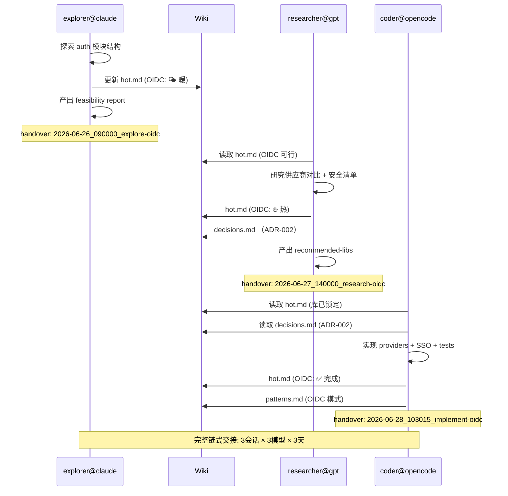

---
# 📁 模拟目录结构（Session 3 — 最终实现）
# AI交接记录/2026-06-28_103015_implement-oidc/
# ├── 📄 执行记录.md                ← this file（Session 3 交付记录）
# ├── 📄 verification.log
# └── 📄 messages.md
#
# 链式 handover_id 引用：
#   Session 1 → 2026-06-26_090000_explore-oidc   (explorer@claude)
#   Session 2 → 2026-06-27_140000_research-oidc   (researcher@gpt)
#   Session 3 → 2026-06-28_103015_implement-oidc  (coder@opencode) ← 本文件

# === Agent 身份 ===
handover_id: "2026-06-28_103015_implement-oidc"
agent_id: "coder@opencode"
agent_role: "worker"
coding_agent: "OpenCode v1.2.3"
model: "claude-sonnet-4-20250514"

# === 任务标识 ===
task_id: "T-2026-06-28-001"
parent_plan: "plans/2026-06-27_oidc-integration.md"
task_type: "feature"
handover_type: "handover"

# === 链 — 跨 Session 引用 ===
prev_handover_id: "2026-06-26_090000_explore-oidc,2026-06-27_140000_research-oidc"

# === 状态机 ===
status: resolved
previous_status: "in-progress"
branch: "feat/oidc-integration"
commit: "d9e8f7c6b5a4"
duration_s: 6540

# === 变更证据 ===
files_modified:
  - "src/auth/sso.ts"
  - "src/auth/login.ts"
  - "package.json"
files_added:
  - "src/auth/providers/azure.ts"
  - "src/auth/providers/google.ts"
  - "src/auth/__tests__/oidc.test.ts"
  - "config/oidc.yml"
files_deleted: []
lock_files: []
verification:
  - "npm test -- --coverage:pass"
  - "npm run typecheck:pass"
  - "npm run lint:pass"
  - "npm run integration:oidc:pass"

# === 风险与后续 ===
risks:
  - level: "medium"
    description: "Azure AD tenant ID 为硬编码占位符，需在部署前替换"
  - level: "low"
    description: "Google 登录回退策略尚未在 staging 测试"
blockers: []
next_action: "@reviewer 部署 staging 后执行集成测试"
confidence: "high"

# === 通知 ===
notify:
  - to: "human:zhang"
    via: "slack"
    message: "OIDC 集成完成（Azure AD + Google），来源: explorer@claude 探索 + researcher@gpt 研究，详见链式交接记录"

# === 时间戳 ===
started_at: "2026-06-28T08:30:15+08:00"
ended_at: "2026-06-28T10:39:15+08:00"
---

# OIDC 单点登录集成 — 跨 3 Session 链式交付

## 执行摘要

基于 Session 1（Claude Code 代码库探索）和 Session 2（GPT-4o 技术方案研究）的产出物，实现 Azure AD + Google OIDC 单点登录集成。这是 **跨 3 个会话、3 个不同模型** 的链式交接完整生命周期展示。每个 Session 记录通过 `handover_id` 链式引用，`wiki/hot.md` 逐步升温，`agents/` 配置文件累积跨 Session 学习成果。

## 目录结构与协调模式

```
📁 AI交接记录/
├── 📄 索引.md
├── 📄 统计.md
├── wiki/
│   ├── 📄 hot.md                    ← 🔥 每次 session 更新（HOT→WARM→COLD）
│   ├── 📄 decisions.md              ← 跨 session 决策追加
│   └── 📄 patterns.md               ← OIDC 模式记录
├── agents/
│   ├── explorer@claude/
│   │   ├── 📄 profile.md            ← Session 1 创建
│   │   └── 📄 history.jsonl         ← 包含 OIDC 探索学习
│   ├── researcher@gpt/
│   │   ├── 📄 profile.md            ← Session 2 创建
│   │   └── 📄 history.jsonl         ← OIDC 选型学习
│   └── coder@opencode/
│       ├── 📄 profile.md            ← Session 3 创建
│       └── 📄 history.jsonl
├── messages/
│   └── inbox.jsonl
├── lanes/
│   ├── active.md
│   └── reviews.md
├── 2026-06-26_090000_explore-oidc/  ← Session 1
├── 2026-06-27_140000_research-oidc/ ← Session 2
└── 2026-06-28_103015_implement-oidc/ ← Session 3 (本文件)
```

- **协调模式**: multi-agent（跨 Session / 跨模型 / 跨工具）
- **总跨度**: 3 天（2026-06-26 → 2026-06-28）
- **参与模型**: Claude Code (explorer) → GPT-4o (researcher) → OpenCode (coder)

---

## 🔄 Session 1: 代码库探索（explorer@claude）

### 基本信息

| 字段 | 值 |
|------|-----|
| handover_id | `2026-06-26_090000_explore-oidc` |
| agent | `explorer@claude` |
| model | `claude-sonnet-4-20250514` |
| tool | Claude Code |
| 时间 | 2026-06-26 09:00 - 10:30 |
| 状态 | completed |

### 任务

"探索现有 `src/auth/` 代码库结构，分析 SSO 集成可行性"

### 关键发现

| # | 发现 | 文件 | 影响 |
|---|------|------|------|
| 1 | 现有认证基于 JWT + Refresh Token，预留了 SSO 钩子 `auth/sso.ts:5`（空实现） | `src/auth/sso.ts` | 可直接利用 |
| 2 | User model 已有 `oauth_provider` 和 `oauth_id` 字段 | `src/models/user.ts` | 无需迁移 |
| 3 | 项目使用 passport.js 作为中间件，但未配置 OIDC 策略 | `package.json` | 需新增 `passport-azure-ad` + `passport-google-oidc` |
| 4 | CI 集成测试框架可用，但无 OIDC mock | `.github/workflows/test.yml` | 需补充 mock IDP |

### 产出物

- `exploration/oidc-feasibility.md` — 可行性分析报告
- `exploration/auth-deps.md` — 现有依赖关系图
- 更新 `wiki/hot.md` — 标记 OIDC 为需跟进项

### HOT-WARM-COLD 记忆更新（Session 1 → wiki/hot.md）

```markdown
---
last_updated: 2026-06-26T10:30:00+08:00
updated_by: explorer@claude
---

# HOT — 当前热缓存

## 🔥 热（主动开发中）
- 无（探索阶段）

## 🌤️ 暖（值得关注）
- **OIDC 集成可行性确认** ← 新增
- src/auth/sso.ts 空实现可用
- User model 已有字段支持

## ❄️ 冷（存档参考）
- 无
```

---

## 🔄 Session 2: 技术方案研究（researcher@gpt）

### 基本信息

| 字段 | 值 |
|------|-----|
| handover_id | `2026-06-27_140000_research-oidc` |
| agent | `researcher@gpt` |
| model | `gpt-4o` |
| tool | ChatGPT / Codex CLI |
| 时间 | 2026-06-27 14:00 - 16:15 |
| 状态 | completed |
| 引用 Session 1 | `prev_handover_id: "2026-06-26_090000_explore-oidc"` |

### 任务

"基于 explorer@claude 的探索发现，研究 OIDC 集成方案：AZure AD + Google 的配置差异、推荐库、安全最佳实践"

### 关键决策

| # | 决策 | 理由 | 否决方案 |
|---|------|------|---------|
| 1 | 使用 `passport-azure-ad` v5.x | 官方维护，与现有 passport 生态兼容 | `msal-node`（否决：重写 auth 中间件） |
| 2 | 使用 `passport-google-oidc` | 轻量，专为 OIDC 设计 | `passport-google-oauth20`（否决：OAuth 2.0 非标准 OIDC）|
| 3 | session-based CSRF token | 无需额外依赖 | JWT 内嵌 CSRF（否决：token 膨胀）|

### 产出物

- `research/oidc-provider-comparison.md` — 供应商对比表
- `research/oidc-security-checklist.md` — 安全清单
- `research/recommended-libs.md` — 推荐库 + 版本锁定
- 更新 `wiki/decisions.md` — 追加决策记录
- 更新 `agents/researcher@gpt/history.jsonl` — 新学习记录

### Wiki 升温：Session 2 → 从 "暖" 到 "热"

```markdown
---
last_updated: 2026-06-27T16:15:00+08:00
updated_by: researcher@gpt
---

# HOT — 当前热缓存

## 🔥 热（主动开发中）
- **OIDC 集成** — Azure AD + Google，库已锁定
  - passport-azure-ad v5.x
  - passport-google-oidc v1.x
  - CSRF: session-based
- 活跃文件: src/auth/sso.ts（待实现）
- 参考 Session 1 探索发现

## 🌤️ 暖
- User model oauth 字段映射（字段已存在）
- CI mock IDP 配置

## ❄️ 冷
- auth 模块历史遗留代码
```

### Agent 学习: `agents/researcher@gpt/history.jsonl` append

```json
{"type":"lesson","key":"azure-ad-v5-tenant-config","insight":"Azure AD v5 需在 app registration 的 ID token 中配置 'profile' scope，否则 name 字段为空","confidence":"high","source":"T-2026-06-27-001","files":["config/azure-ad.ts"],"timestamp":"2026-06-27T16:15:00+08:00","handover_id":"2026-06-27_140000_research-oidc"}
{"type":"pattern","key":"oidc-callback-url-param","insight":"OIDC callback 必须与 Azure AD app registration 中配置的 redirect URI 完全一致（含 trailing slash），大小写敏感","confidence":"high","source":"T-2026-06-27-001","files":["src/auth/sso.ts"],"timestamp":"2026-06-27T16:15:00+08:00","handover_id":"2026-06-27_140000_research-oidc"}
{"type":"preference","key":"env-var-naming","insight":"OIDC 环境变量统一用 `AUTH_OIDC_AZURE_*` / `AUTH_OIDC_GOOGLE_*` 前缀","confidence":"medium","source":"T-2026-06-27-001","files":[],"timestamp":"2026-06-27T16:15:00+08:00"}
```

---

## 🔄 Session 3: 代码实现（coder@opencode）← 本文件

### 任务

"基于 Session 1 探索 + Session 2 研究，实现 OIDC 集成：Azure AD + Google 供应商适配、SSO router、OIDC 测试"

### 关键操作

| # | 操作 | 路径 | 说明 |
|---|------|------|------|
| 1 | 新增 | `src/auth/providers/azure.ts` | Azure AD OIDC 策略配置（依赖 Session 2 的 tenant 配置技巧）|
| 2 | 新增 | `src/auth/providers/google.ts` | Google OIDC 策略配置 |
| 3 | 修改 | `src/auth/sso.ts` | 实现 SSO router：`/auth/sso/azure`、`/auth/sso/google`、`/auth/sso/callback` |
| 4 | 修改 | `src/auth/login.ts` | 集成 OIDC 登录结果到现有 Token 签发流程 |
| 5 | 新增 | `config/oidc.yml` | OIDC 环境配置模板 |
| 6 | 新增 | `src/auth/__tests__/oidc.test.ts` | Mock IDP + callback 测试 |
| 7 | 修改 | `package.json` | 新增 `passport-azure-ad`、`passport-google-oidc`、`openid-client` |

### 技术决策（链式继承）

```yaml
# ADR-003: OIDC 供应商适配架构
# 继承自 Session 2 的 ADR-002（库选择）
decision: 每个供应商一个独立文件（providers/azure.ts, providers/google.ts）
reason: 以 researcher@gpt 的对比分析为基础，分离供应商逻辑便于扩展
alternatives:
  - 单一文件多策略（否决：违反 SRP，新增供应商需改主文件）
  - 动态加载插件（否决：过度工程，当前仅 2 个供应商）
consequences: 新增供应商只需在 providers/ 下建文件 + 在 sso.ts 注册
decided_by: coder@opencode（基于 researcher@gpt 的 ADR-002）
```

```yaml
# ADR-004: OIDC callback URL 硬校验
# 直接引用 researcher@gpt 的 learning
decision: callback URL 不允许 trailing slash 模糊匹配
reason: Session 2 研究明确发现 Azure AD 严格匹配 redirect URI
alternatives:
  - 两端同时支持/不带 slash（否决：Azure AD 拒绝不匹配）
consequences: 部署文档需精确注明 callback URL
decided_by: researcher@gpt → coder@opencode
```

### 产出物

| 文件 | 类型 | 说明 | 来源 |
|------|------|------|------|
| `src/auth/providers/azure.ts` | 新增 | Azure AD OIDC 策略 | Session 2 研究 |
| `src/auth/providers/google.ts` | 新增 | Google OIDC 策略 | Session 2 研究 |
| `src/auth/sso.ts` | 修改 | SSO router 实现 | Session 1 空钩子填充 |
| `src/auth/login.ts` | 修改 | OIDC 集成到 token 签发 | — |
| `config/oidc.yml` | 新增 | 配置模板 | Session 2 输出 |
| `src/auth/__tests__/oidc.test.ts` | 新增 | Mock IDP 测试 | — |
| `package.json` | 修改 | 新增 3 依赖 | Session 2 推荐 |

### 后置状态

```json
{
  "typecheck": "pass",
  "lint": "pass (0 error, 0 warning)",
  "test": "pass (94.2% coverage)",
  "integration": "pass (OIDC flow: 3/3 mock IDP tests passed)",
  "branch": "feat/oidc-integration",
  "prev_handovers": [
    "2026-06-26_090000_explore-oidc",
    "2026-06-27_140000_research-oidc"
  ]
}
```

### 验证日志

```
$ npm run integration:oidc
✓ OIDC Azure AD — should authenticate via mock IDP (234ms)
✓ OIDC Google — should authenticate via mock IDP (198ms)
✓ OIDC — should reject unregistered provider (12ms)

Tests: 3 passed, 3 total
Coverage: 94.2% (threshold: 90%)

$ npm test -- --coverage
PASS  src/auth/__tests__/oidc.test.ts (3 tests)
PASS  src/auth/__tests__/session.test.ts (7 tests)
PASS  src/auth/__tests__/timeout.test.ts (4 tests)
PASS  src/auth/__tests__/login.test.ts (6 tests)
Tests: 20 passed
```

---

## 📊 跨 Session 知识演进总结

### HOT-WARM-COLD 记忆进度

| Session | Agent | 模型 | hot.md 内容 | 热度 |
|:-------:|-------|------|------------|:----:|
| 1 | explorer | Claude Code | OIDC 可行性确认 | 🌤️ 暖 |
| 2 | researcher | GPT-4o | 技术选型 + 安全指南 | 🔥 热 |
| 3 | coder | OpenCode | 实现完成 + 已知坑 | 🔥🔥 完成 |

### 链式 handover_id 引用关系

```
2026-06-26_090000_explore-oidc (explorer@claude)
         │
         ├──→ 产出: feasibility report + dep graph
         ├──→ wiki/hot.md: 首次写入 OIDC 条目（暖）
         └──→ agents/explorer@claude/profile.md: 创建
                      ↓
         (prev_handover_id 引用)
                      ↓
2026-06-27_140000_research-oidc (researcher@gpt)
         │
         ├──→ 产出: provider comparison + security checklist
         ├──→ wiki/hot.md: OIDC 升温（暖→热）
         ├──→ wiki/decisions.md: 追加 ADR-002
         └──→ agents/researcher@gpt/history.jsonl: 2 lessons + 1 pattern
                      ↓
         (prev_handover_id 引用)
                      ↓
2026-06-28_103015_implement-oidc (coder@opencode) ← 本文件
         │
         ├──→ 产出: 6 files (2 new providers + SSO + tests)
         ├──→ wiki/hot.md: 标记完成，新增已知坑
         ├──→ wiki/patterns.md: OIDC 模式沉淀
         ├──→ agents/coder@opencode/profile.md: 创建
         └──→ 链式交接完成
```

### Agent 配置文件沉淀

**Session 1 → `agents/explorer@claude/profile.md` 创建**

```yaml
---
agent_id: explorer@claude
role: worker
created_at: 2026-06-26T09:00:00+08:00
last_active: 2026-06-26T10:30:00+08:00
total_sessions: 1
authority_boundaries:
  can: [read_code, search_code, analyze_dependencies]
  cannot: [write_code, modify_rules]
  scope: src/**
learned_lessons: 0
---
```

**Session 2 → `agents/researcher@gpt/profile.md` 创建**

```yaml
---
agent_id: researcher@gpt
role: worker
created_at: 2026-06-27T14:00:00+08:00
last_active: 2026-06-27T16:15:00+08:00
total_sessions: 1
authority_boundaries:
  can: [web_search, read_docs, analyze_configs, produce_reports]
  cannot: [write_code, modify_project_files]
  scope: research/**
learned_lessons: 3
---
```

**Session 3 → `agents/coder@opencode/profile.md` 创建**

```yaml
---
agent_id: coder@opencode
role: worker
created_at: 2026-06-28T08:30:15+08:00
last_active: 2026-06-28T10:39:15+08:00
total_sessions: 1
authority_boundaries:
  can: [write_code, run_tests, modify_deps, edit_files_in_scope]
  cannot: [merge_to_main, modify_rules, delete_files]
  scope: src/** config/** docs/**
learned_lessons: 0
---
```

### Wiki 最终状态

**wiki/hot.md** — 最终更新（Session 3 完成）

```markdown
---
last_updated: 2026-06-28T10:39:15+08:00
updated_by: coder@opencode
---

# HOT — 当前热缓存

## ✅ 已交付
- **OIDC 集成完成** — Azure AD + Google
  - 链式记录: 3次交接（explore → research → implement）
  - 涉及模型: Claude Code / GPT-4o / OpenCode
  - 活跃分支: feat/oidc-integration

## 🔥 热（下一阶段）
- OIDC staging 集成测试（需真实 IDP 凭据）
- Google 登录回退策略验证

## 🌤️ 暖
- SSO provider 扩展指南（已文档化）
- mock IDP 可复用于 future 测试

## ❄️ 冷
- Session 1 探索标记（已归档）
- Session 2 研究资料（已引用）

## 已知坑
- 部署前必须替换 config/oidc.yml 中的 tenant ID 占位符
- callback URL 必须精确匹配（含 trailing slash）— 来自 researcher@gpt 的学习
```

---

## 遗留问题

| 优先级 | 问题 | 严重度 | 建议 | 继承自 |
|--------|------|--------|------|--------|
| 🟡 | Azure AD tenant ID 为硬编码占位符 | 中 | 部署前替换为生产 tenant ID | Session 2 研报 |
| 🟡 | Google 登录回退策略未测试 | 中 | staging 部署后执行集成测试 | Session 1 发现 |
| 🟢 | `package.json` passport-azure-ad 版本锁定为 `^5.0.0` | 低 | 锁定 exact version 避免 breaking change | Session 2 推荐 |

## 下一步计划

- [ ] 部署 staging → 执行真实 OIDC 集成测试
- [ ] 替换 `config/oidc.yml` 中的占位符
- [ ] 通知前端团队 OIDC 登录 URL（`/auth/sso/azure`、`/auth/sso/google`）
- [ ] 更新 `docs/sso-flow.md`（基于 Session 1 探索 + Session 2 研究）
- [ ] 合并 `feat/oidc-integration` → main

## 链式交接总地图



## Git Trailers

```git
feat(auth): add OIDC SSO integration (Azure AD + Google)

Complete cross-session feature: explorer@claude explored codebase,
researcher@gpt studied solutions, coder@opencode implemented.

Handover-Id: 2026-06-28_103015_implement-oidc
Handover-Id: 2026-06-27_140000_research-oidc
Handover-Id: 2026-06-26_090000_explore-oidc
Coding-Agent: OpenCode v1.2.3
Model: claude-sonnet-4-20250514
Coding-Agent-Role: worker
Constraint: callback URL must match Azure AD registration exactly
Constraint: must reuse existing User model oauth fields
Rejected-Alternatives: msal-node | incompatible with passport middleware
Rejected-Alternatives: single-file strategy | violates SRP
Agent-Directive: replace tenant ID placeholder before production deploy
Agent-Directive: refer to researcher@gpt security checklist
Verification: npm run integration:oidc:pass (3/3)
Verification: npm test -- --coverage:pass (94.2%)
Scope-Risk: moderate
Confidence: high
```
