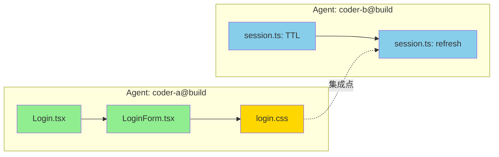

---
# 📁 模拟目录结构
# AI交接记录/2026-06-26_160000_login-session-parallel/
# ├── 📄 执行记录.md  ← this file (codder-a@build 的交接记录)
# ├── 📄 verification.log
# ├── messages/
# │   └── 📄 inbox.jsonl   ← 含 status_report 消息
# └── lanes/
#     ├── 📄 active.md     ← 显示两个并行任务
#     └── 📄 reviews.md

# === Agent 身份 ===
handover_id: "2026-06-26_160000_login-session-parallel"
agent_id: "coder-a@build"
agent_role: "worker"
coding_agent: "OpenCode v1.2.3"
model: "claude-sonnet-4-20250514"

# === 任务标识 ===
task_id: "T-2026-06-26-003"
parent_plan: "plans/2026-06-26_login-session-feature.md"
task_type: "feature"
handover_type: "handover"

# === 状态机 ===
status: "in-progress"
previous_status: "idle"
branch: "agent-coder-a/feat-login-ui"
commit: "b2c3d4e5f6a7"
duration_s: 2100

# === 变更证据 ===
files_modified:
  - "src/components/Login.tsx"
  - "src/components/LoginForm.tsx"
files_added:
  - "src/styles/login.css"
files_deleted: []
verification:
  - "npm test -- --grep login:pass"
  - "npm run typecheck:pass"
  - "npm run lint:pass"

# === 并行协调 ===
parallel_with:
  - agent: "coder-b@build"
    task_id: "T-2026-06-26-004"
    branch: "agent-coder-b/fix-session-timeout"
    files: ["src/auth/session.ts"]
    status: "in-progress"

# === 文件锁 ===
file_locks:
  - held_by: "coder-a@build"
    files:
      - "src/components/Login.tsx"
      - "src/components/LoginForm.tsx"
      - "src/styles/login.css"
    since: "2026-06-26T07:30:00Z"
    status: "in_progress"
  - held_by: "coder-b@build"
    files:
      - "src/auth/session.ts"
    since: "2026-06-26T07:32:00Z"
    status: "in_progress"

# === 风险与后续 ===
risks:
  - level: "low"
    description: "Login UI 和 session 管理并行开发，合并时需验证集成点"
blockers: []
next_action: "@coder-b@build session timeout 修复完成后通知我，一起提交 review"
confidence: "high"

# === 通知 ===
notify:
  - to: "@coder-b@build"
    via: "inbox"
    message: "Login UI 基础结构完成，正在处理表单验证。你的 session 修复进度如何？"
  - to: "build@orchestrator"
    via: "inbox"
    message: "两个并行任务均在进行中，无文件冲突"

# === 时间戳 ===
started_at: "2026-06-26T07:30:00+08:00"
ended_at: "2026-06-26T08:05:00+08:00"
---

# 并行开发：登录 UI + Session 管理

## 执行摘要

两个 Agent 并行工作：`coder-a@build` 实现登录 UI（Login.tsx + LoginForm.tsx），`coder-b@build` 修复 Session 超时管理（session.ts）。两份工作不涉及相同文件，因此可以安全并行。通过 `messages/inbox.jsonl` 和 `lanes/active.md` 协调进度。

## 目录结构与协调模式

```
📁 AI交接记录/2026-06-26_160000_login-session-parallel/
├── 📄 执行记录.md            ← 本文件（coder-a@build 视角）
├── 📄 verification.log
├── messages/
│   └── 📄 inbox.jsonl        ← status_report 消息
├── lanes/
│   ├── 📄 active.md          ← 两个并行任务
│   └── 📄 reviews.md
```

- **协调模式**: parallel（双 Agent 并行，无文件冲突）
- **关键原则**: 两 Agent 不触碰同一文件，消息队列是唯一通信渠道

---

## 🔄 并行任务总览

### 依赖图



| 颜色 | 含义 |
|------|------|
| 🟢 | 已完成 |
| 🟡 | 进行中 |
| 🔵 | 进行中 |

### 任务对比

| 维度 | coder-a@build | coder-b@build |
|------|--------------|--------------|
| **任务** | 登录 UI 实现 | Session 超时修复 |
| **分支** | `agent-coder-a/feat-login-ui` | `agent-coder-b/fix-session-timeout` |
| **文件** | `Login.tsx`, `LoginForm.tsx`, `login.css` | `session.ts` |
| **状态** | `in-progress`（75%） | `in-progress`（40%） |
| **分支命名** | `agent-{id}/{type}-{desc}` | `agent-{id}/{type}-{desc}` |
| **文件锁** | `locks/agent-coder-a.json` | `locks/agent-coder-b.json` |
| **冲突风险** | 无（不同文件） | 无（不同文件） |

### 文件锁状态

#### `.ai-handover/locks/coder-a.json`

```json
{
  "held_by": "coder-a@build",
  "since": "2026-06-26T07:30:00Z",
  "task_id": "T-2026-06-26-003",
  "files": [
    "src/components/Login.tsx",
    "src/components/LoginForm.tsx",
    "src/styles/login.css"
  ],
  "status": "in_progress",
  "heartbeat": "2026-06-26T07:55:00Z"
}
```

#### `.ai-handover/locks/coder-b.json`

```json
{
  "held_by": "coder-b@build",
  "since": "2026-06-26T07:32:00Z",
  "task_id": "T-2026-06-26-004",
  "files": [
    "src/auth/session.ts"
  ],
  "status": "in_progress",
  "heartbeat": "2026-06-26T07:57:00Z"
}
```

---

## 📨 消息队列（messages/inbox.jsonl）

```jsonl
{"msg_id":"m-001","type":"status_report","priority":"normal","from":"coder-a@build","to":"coder-b@build","subject":"Login UI 基础结构完成","task_id":"T-2026-06-26-003","branch":"agent-coder-a/feat-login-ui","files":["src/components/Login.tsx","src/components/LoginForm.tsx"],"body":"Login UI 基础结构完成。\n- Login.tsx: 表单骨架 + 事件绑定 ✅\n- LoginForm.tsx: 输入组件 + 基本验证 ✅\n- login.css: 样式框架 进行中 (~60%)\n\n我这边预计 15min 内完成样式。你的 session 修复进度如何？\n集成点：Login 表单提交后调用 session.ts 的 authenticate()。","created_at":"2026-06-26T07:50:00+08:00","status":"pending"}
{"msg_id":"m-002","type":"status_report","priority":"normal","from":"coder-b@build","to":"coder-a@build","subject":"Session TTL 修复进行中","task_id":"T-2026-06-26-004","branch":"agent-coder-b/fix-session-timeout","files":["src/auth/session.ts"],"body":"收到，我这边进度：\n- Session TTL 计算逻辑已修复 ✅\n- 单元测试编写中 (60%)\n\n预计 20min 完成。``session.ts:authenticate()`` 的签名不变，你的 Login 可以直接调用。\n\n完成后我会发 review_request。","created_at":"2026-06-26T07:55:00+08:00","status":"responded","in_reply_to":"m-001"}
```

---

## 🛤️ Lane 状态（lanes/active.md）

```yaml
---
updated_at: 2026-06-26T08:05:00+08:00
updated_by: coder-a@build
---

# Active Lane

## 并行任务

| 任务 | Agent | 分支 | 状态 | 进度 | 文件锁 | 阻塞 |
|------|-------|------|:----:|:----:|:------:|:----:|
| T-003: 登录 UI | coder-a@build | agent-coder-a/feat-login-ui | `in-progress` | 75% | ✅ | 无 |
| T-004: Session 修复 | coder-b@build | agent-coder-b/fix-session-timeout | `in-progress` | 40% | ✅ | 无 |

## T-003: 登录 UI（coder-a@build）

- [x] Login.tsx 表单骨架
- [x] LoginForm.tsx 输入组件 + 基本验证
- [ ] login.css 样式（60%）
- [ ] 与 session.ts 集成测试
- [ ] review

## T-004: Session 修复（coder-b@build）

- [x] Session TTL 计算逻辑修复
- [ ] 单元测试（60%）
- [ ] 集成测试
- [ ] review

## 下一步

1. coder-a@build 完成 login.css
2. coder-b@build 完成单元测试
3. 两 Agent 各自提交 review_request
4. reviewer 审查（可并行审查不同文件）
5. 合并到 main（需确认集成点正常）
```

---

## YAML Frontmatter（coder-b@build 的交接记录预览）

```yaml
---
handover_id: "2026-06-26_161500_session-fix-parallel"
agent_id: "coder-b@build"
agent_role: "worker"
coding_agent: "OpenCode v1.2.3"
model: "claude-sonnet-4-20250514"
task_id: "T-2026-06-26-004"
task_type: "fix"
handover_type: "handover"
status: "needs-review"
previous_status: "in-progress"
branch: "agent-coder-b/fix-session-timeout"
files_modified:
  - "src/auth/session.ts"
files_added:
  - "src/auth/__tests__/session-timeout.test.ts"
files_deleted: []
verification:
  - "npm test -- --grep session:pass (12/12)"
  - "tsc --noEmit:pass"
next_action: "@reviewer please review src/auth/session.ts:TTL 计算逻辑"
parallel_with:
  - agent: "coder-a@build"
    task_id: "T-2026-06-26-003"
    branch: "agent-coder-a/feat-login-ui"
    status: "in-progress"
---
```

## 产出物

### coder-a@build

| 文件 | 类型 | 说明 |
|------|------|------|
| `src/components/Login.tsx` | 修改 | 登录表单骨架 + 事件绑定 |
| `src/components/LoginForm.tsx` | 修改 | 输入组件 + 基本验证逻辑 |
| `src/styles/login.css` | 新增 | 登录页样式框架 |

### coder-b@build

| 文件 | 类型 | 说明 |
|------|------|------|
| `src/auth/session.ts` | 修改 | TTL 计算逻辑修复 |
| `src/auth/__tests__/session-timeout.test.ts` | 新增 | 超时场景测试 |

## 验证日志

```
$ npm test -- --grep login
PASS  src/components/__tests__/Login.test.tsx (4 tests)
  ✓ should render login form (8ms)
  ✓ should validate email format (3ms)
  ✓ should show error on invalid input (5ms)
  ✓ should call authenticate on submit (12ms)

$ npm run typecheck && npm run lint
TypeScript: no errors
ESLint: 0 error, 0 warning
```

## 遗留问题

| 优先级 | 问题 | 严重度 | 建议 |
|--------|------|--------|------|
| 🟡 | Login UI 和 session 管理合并时需验证集成点 | 中 | 两 Agent 完成后执行一次集成测试 |
| 🟢 | login.css 样式尚未响应式适配 | 低 | 下一轮迭代补充 mobile 适配 |

## 下一步计划

1. [ ] coder-a@build 完成 login.css 剩余 40%
2. [ ] coder-b@build 完成 session 单元测试
3. [ ] 两 Agent 分别提交 review_request
4. [ ] reviewer 并行审查（无文件重叠）
5. [ ] 合并前执行集成测试验证 Login → Session 调用链
6. [ ] 通知 `human:zhang` 合并窗口

## Git Trailers

```git
feat(ui): add login form with validation

Implement login UI components with form validation.

Handover-Id: 2026-06-26_160000_login-session-parallel
Coding-Agent: OpenCode v1.2.3
Model: claude-sonnet-4-20250514
Coding-Agent-Role: worker
Parallel-With: agent-coder-b/fix-session-timeout (T-2026-06-26-004)
Constraint: Login.tsx must call session.ts:authenticate() unchanged
Constraint: no shared files with coder-b@build
Verification: npm test -- --grep login:pass (4/4)
Verification: tsc --noEmit:pass
Scope-Risk: narrow
Confidence: high
```
