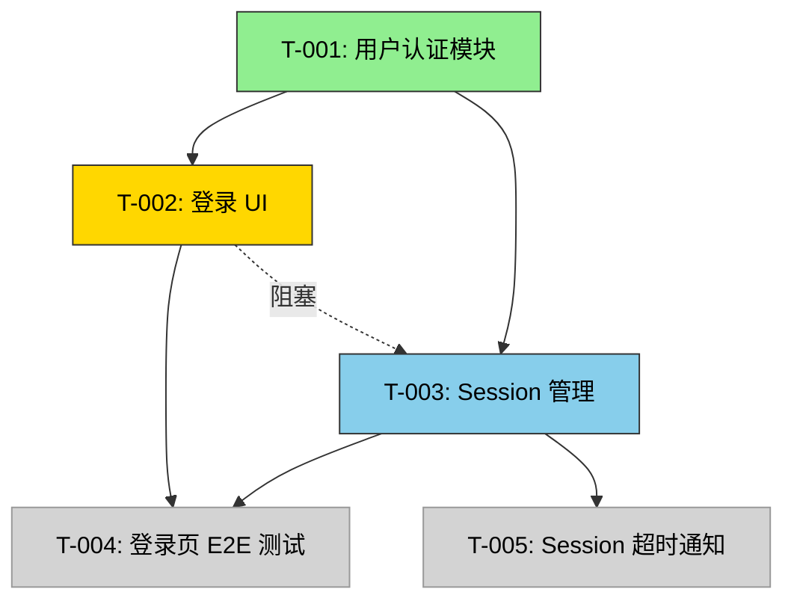

# 任务依赖图

> 用于并行 Agent 协作时的任务依赖管理。dependencies 必须在任何任务状态变更后同步更新。

## 依赖图



| 颜色 | 含义 |
|------|------|
| 🟢 绿色 | completed |
| 🟡 黄色 | in-progress（被阻塞） |
| 🔵 蓝色 | in-progress（正常） |
| ⚪ 灰色 | pending / 未开始 |

## 活跃依赖

| 任务 | Agent | 依赖 | 被依赖 | 状态 | 阻塞 |
|------|-------|------|--------|------|------|
| T-001 | `coder-a@build` | — | T-002, T-003 | `completed` | — |
| T-002 | `coder-b@build` | T-001 | T-004 | `in-progress` | ⛔ 被 T-003 阻塞 |
| T-003 | `coder-c@build` | T-001 | T-004, T-005 | `in-progress` | — |
| T-004 | `reviewer@build` | T-002, T-003 | — | `pending` | 等待 T-002, T-003 |
| T-005 | `coder-c@build` | T-003 | — | `pending` | 等待 T-003 |

## 阻塞链

```
T-002 (blocked)
  └── 被 T-003 阻塞 → T-003 状态: in-progress, ETA: ~10min
       └── T-003 依赖 T-001 → T-001 状态: completed ✅
```

## 规则

1. **dependencies 必须在任何任务状态变更后同步更新**
2. 被阻塞的任务标记 `blocked` 状态，并在 lanes/active.md 的 blockers 字段注明原因
3. 依赖链的最上游任务优先调度（拓扑排序）
4. 当被依赖任务完成时，阻塞任务自动解除阻塞（由 build 确认后恢复）
5. 不允许循环依赖——检测到循环 → 立即 [ESCALATE] 给 build 重新规划
