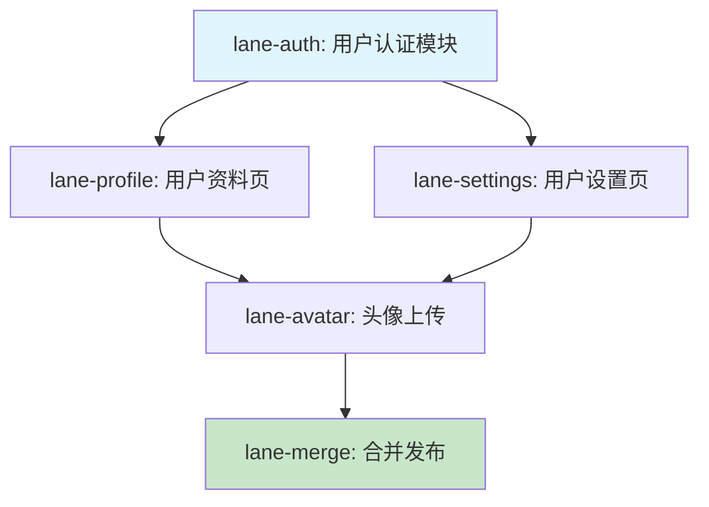

---
metadata:
  title: AI Handover — 多 Agent 协调规范
  version: 1.0.0
  component: ai-handover
  status: active
  valid_at: 2026-06-26
  provenance: "ai-handover v4.1 — IRON RULE #5/#6"
  dependencies:
    - SKILL.md §Lane 状态机
    - SKILL.md §并行 Agent 协调
    - rules/00-core.md
    - rules/03-git.md
    - references/templates/lanes/state.md
    - references/templates/messages/handoff.md
---

# 多 Agent 协调规范

> **版本**: 1.0.0 | **更新**: 2026-06-26 | **组件**: ai-handover v4.1
> **IRON RULE**: #5（串行状态门控）、#6（并行文件锁）

---

## 1. 概述

多 Agent 协调使多个 AI agent 能在同一项目中**串行**（pipeline 流水线）或**并行**（独立子任务）协作，同时避免冲突、死锁和状态丢失。

| 模式 | 适用场景 | 核心约束 |
|------|---------|---------|
| **串行** | coder → reviewer → fix → merge | IRON RULE #5：状态门控 |
| **并行** | 多个独立子任务同时执行 | IRON RULE #6：文件锁 |

**基本原则**：
- 每条 lane 同时只允许一个 agent 持有 write 权限
- 跨 agent 通信必须经过消息协议（`@mention`），禁止直接修改对方输出
- 所有状态变更必须记录到 lanes 目录，心跳超时自动释放锁

---

## 2. 串行协调 — 状态门控（IRON RULE #5）

### 2.1 状态图

```
                  ┌──────────────────────────────────────┐
                  │                                      │
                  v                                      │
  ┌──────┐  ┌──────────┐  ┌──────────────┐  ┌──────────────┐
  │ idle │→│ in-progress│→│ needs-review │→│ready-for-merge│→ resolved
  └──────┘  └──────────┘  └──────────────┘  └──────────────┘
                  ↑              │                   │
                  │              │  changes-requested│
                  │              └──────────────────┘
                  │                                   │
                  │              ┌─────────┐          │
                  └──────────────│ blocked │←─────────┘
                                 └─────────┘
```

### 2.2 状态说明

| 状态 | 含义 | 谁可持有 | 超时 |
|------|------|---------|------|
| `idle` | 空闲，待分配 | 任何人 | — |
| `in-progress` | 正在执行 | 执行 agent | 30min |
| `needs-review` | 待审查 | orchestrator | — |
| `changes-requested` | 需修改 | 执行 agent | 15min |
| `ready-for-merge` | 审查通过，待合并 | orchestrator/merge agent | — |
| `blocked` | 阻塞（外部依赖） | 阻塞 agent | 可配置 |
| `resolved` | 已完成 | — | — |

### 2.3 状态转换规则

每条转换必须满足**前置条件**（precondition），否则 orchestrator 应拒绝转换。

| 从 | 到 | 前置条件 | 操作 |
|------|-----|---------|------|
| `idle` | `in-progress` | lane 已分配，执行 agent 已确认 | 创建 lane 文件，设置 owner |
| `in-progress` | `needs-review` | 执行完成，输出物已写入 | 设置 `next_action: @reviewer` |
| `needs-review` | `changes-requested` | reviewer 提出修改要求 | 设置 `next_action: @coder`，附带 feedback |
| `changes-requested` | `in-progress` | coder 已确认修改 | 重新激活执行 |
| `needs-review` | `ready-for-merge` | reviewer 批准，无 blocking 问题 | 设置 `next_action: @merger` |
| `ready-for-merge` | `resolved` | merge 完成，无冲突 | 实际合并操作为证 |
| 任意 | `blocked` | 外部依赖缺失 / 等待用户输入 | 记录阻塞原因 |
| `blocked` | `in-progress` | 阻塞解除 | 恢复到最近的非阻塞状态 |

### 2.4 next_action 格式

串行 pipeline 中，每个 lane 状态文件必须包含 `next_action` 字段：

```yaml
next_action: "@<agent_role> <动作描述> [deadline: <时间>]"
```

示例：
```yaml
next_action: "@reviewer review PR #42"
next_action: "@coder fix type errors in src/utils.ts (deadline: 15min)"
next_action: "@merger merge after CI passes"
```

**格式要求**：
- 必须以 `@` 开头引用目标 agent 角色
- 必须包含具体动作描述（至少 5 个字）
- 可选 deadline（不指定则使用默认 SLA）

### 2.5 SLA 表

| 指标 | 串行 pipeline | 并行子任务 |
|------|--------------|-----------|
| 心跳间隔 | 60s | 120s |
| 空闲回收 | 120s 无活动 | 300s 无活动 |
| 单次任务超时 | 30min | 60min |
| Review 超时 | 15min | 30min |
| 死锁检测 | 连续 3 次 ping 无响应 | 同左 |

---

## 3. 并行协调 — 文件锁（IRON RULE #6）

### 3.1 锁文件格式

当多个 agent 并行执行时，**修改任何文件前必须先获取文件锁**。锁文件存储在 `.ai-handover/locks/` 目录下。

```json
{
  "file": "src/components/UserProfile.tsx",
  "locked_by": "agent-coder-42",
  "lane_id": "lane-feature-user-avatar",
  "acquired_at": "2026-06-26T10:00:00Z",
  "heartbeat_at": "2026-06-26T10:01:00Z",
  "reason": "implementing avatar upload feature",
  "status": "active"
}
```

### 3.2 锁生命周期

```
1️⃣ 创建锁（acquire）
   ├─ 检查 `.ai-handover/locks/<hash>.json` 是否存在
   ├─ 不存在 → 写入锁文件
   └─ 存在 → 检查是否 stale（>30min 无心跳）→ 是则可覆盖，否则等待

2️⃣ 持锁工作
   ├─ 每 60s 更新 `heartbeat_at`
   └─ 工作完成 → 进入下一步

3️⃣ 释放锁（release）
   ├─ 删除锁文件
   └─ 更新 lanes 状态
```

### 3.3 锁文件命名

锁文件路径基于目标文件路径的 SHA-256 哈希前 16 位：

```
.ai-handover/locks/<file_hash>.json
```

示例：`src/components/UserProfile.tsx` → SHA-256 前 16 位 → `a1b2c3d4e5f6a7b8.json`

### 3.4 Stale 锁检测

| 场景 | 判定规则 | 处理方式 |
|------|---------|---------|
| 无心跳 > 30min | stale | 自动生成 warning，释放锁 |
| 有冲突锁 | `locked_by` 与当前 agent 不同 | 向两个 agent 发送消息，orchestrator 裁决 |
| 同 agent 重复申请 | `locked_by` 相同 | 自动续期（更新时间戳） |

### 3.5 冲突解决流程

当两个 agent 试图同时修改同一文件时：

1. 第二个 agent 读取锁文件，检测到冲突
2. 向持有锁的 agent 发送 `@agent-coder-42 请求文件锁释放：src/components/UserProfile.tsx`
3. 等待回应（超时 30s）
4. 如无回应 → 向 orchestrator 发送 blocker
5. Orchestrator 裁决：优先 lane 继续 / 回退 / 重新规划

### 3.6 分支策略参考

并行子任务应在独立分支上工作，分支命名规则：

```
<lane-type>/<lane-id>/<brief-description>
```

示例：
```
feature/lane-user-avatar/avatar-upload
feature/lane-user-profile/bio-editor
fix/lane-login-bug/session-timeout
```

分支合并策略详见 `rules/03-git.md`。

---

## 4. 消息协议

### 4.1 铁则（5 IRON RULES）

| # | 规则 | 违反后果 |
|---|------|---------|
| 1 | 每条消息必须有且仅有一个 `@` 目标 agent | 消息被忽略 |
| 2 | 禁止同一消息 @ 两个以上 agent | 路由混乱 |
| 3 | agent 只对自己的 @mention 做出响应，禁止"旁听" | 干扰其他 agent 工作 |
| 4 | 同一 `@mention` 最多响应 1 次，重复提及视为同一轮 | 循环攻击 |
| 5 | 回复必须在 30s 内（review 类 60s），超时即 escalate | 阻塞 pipeline |

### 4.2 消息类型

| 类型 | 用途 | 示例 |
|------|------|------|
| `review_request` | 请求审查 | `@reviewer review PR #42` |
| `review_response` | 审查反馈 | `@coder please fix L123 type error` |
| `blocker_raised` | 报告阻塞 | `@orchestrator blocked: missing API key` |
| `question` | 技术询问 | `@coder is this interface still valid?` |
| `answer` | 回复问题 | `@reviewer yes, it's in src/types.ts` |
| `status_report` | 状态汇报 | `@orchestrator task completed 80%` |
| `proposal` | 变更建议 | `@orchestrator propose to split this lane` |

### 4.3 消息存储（inbox.jsonl）

所有跨 agent 消息存储在 lanes 目录的 inbox.jsonl 文件中。格式为 JSONL（每行一个 JSON 对象）：

```json
{
  "id": "msg-20260626-001",
  "timestamp": "2026-06-26T10:05:00Z",
  "type": "review_request",
  "priority": "high",
  "from": "agent-coder-42",
  "to": "agent-reviewer-01",
  "body": "@agent-reviewer-01 please review PR #42: feature/avatar-upload",
  "lane_id": "lane-feature-user-avatar",
  "status": "pending",
  "context": {
    "branch": "feature/lane-user-avatar/avatar-upload",
    "pr_url": "https://github.com/org/repo/pull/42"
  }
}
```

**7 个必填字段**（缺失则消息无效）：

| 字段 | 说明 |
|------|------|
| `id` | 唯一 ID（`msg-YYYYMMDD-NNN` 格式） |
| `timestamp` | ISO 8601 |
| `type` | 消息类型（见 4.2） |
| `from` | 发送者 agent ID |
| `to` | 接收者 agent ID |
| `body` | 消息正文（必须以 `@<agent>` 开头） |
| `lane_id` | 所属 lane |

### 4.4 优先级

| 等级 | 标记 | 响应 SLA | 颜色 |
|------|------|---------|------|
| `blocking` | pipeline 阻塞 | 立即响应（< 10s） | 🔴 |
| `high` | 必须处理 | 30s | 🟠 |
| `normal` | 常规 | 60s | 🟢 |
| `low` | 可延迟 | 5min | ⚪ |

### 4.5 反循环控制

为防止 agent 间无限对话循环：

- **单次响应限制**：同一 `@mention` 最多产生 1 条回复。需要继续讨论必须发起新消息（新 `id`）
- **主题锁定**：同一 `lane_id` 下，同类型消息连续出现 3 次 → 自动 escalate 给 orchestrator
- **禁止旁听**：agent 只读取 `to` 字段指向自己的消息，不得扫描全部 inbox
- **冷却期**：同一 sender → same receiver 消息间隔至少 3s

---

## 5. Lane 状态机完整参考

### 5.1 8 个状态

| 编号 | 状态 | 描述 | 是否 terminal |
|------|------|------|-------------|
| S1 | `idle` | Lane 已创建但未开始执行 | 否 |
| S2 | `in-progress` | 正在由某个 agent 执行 | 否 |
| S3 | `needs-review` | 执行完成，等待审查 | 否 |
| S4 | `changes-requested` | 审查不通过，需要修改 | 否 |
| S5 | `ready-for-merge` | 审查通过，准备合并 | 否 |
| S6 | `blocked` | 因外部依赖阻塞 | 否 |
| S7 | `resolved` | 任务完成，lane 关闭 | 是 |
| S8 | `cancelled` | 任务取消 | 是 |

### 5.2 有效转换矩阵

✓ = 允许，✗ = 禁止，E = 需 escalate

| 从\到 | S1 | S2 | S3 | S4 | S5 | S6 | S7 | S8 |
|-------|----|----|----|----|----|----|----|----|
| S1 | — | ✓ | ✗ | ✗ | ✗ | ✗ | ✗ | ✓ |
| S2 | ✗ | — | ✓ | ✗ | ✗ | ✓ | ✗ | ✓ |
| S3 | ✗ | ✗ | — | ✓ | ✓ | ✓ | ✗ | ✓ |
| S4 | ✗ | ✓ | ✗ | — | ✗ | ✓ | ✗ | ✓ |
| S5 | ✗ | ✗ | ✗ | ✗ | — | ✓ | ✓ | ✓ |
| S6 | ✗ | ✓ | ✗ | ✗ | ✗ | — | ✓ | ✓ |
| S7 | ✗ | ✗ | ✗ | ✗ | ✗ | ✗ | — | ✗ |
| S8 | ✗ | ✗ | ✗ | ✗ | ✗ | ✗ | ✗ | — |

### 5.3 Lane SLA 详表

| 指标 | 串行 lane | 并行 lane | review lane |
|------|----------|-----------|-------------|
| 心跳间隔 | 60s | 120s | 60s |
| 空闲超时 | 120s | 300s | 120s |
| 任务超时 | 30min | 60min | 15min |
| 最大重试次数 | 3 | 2 | 2 |
| 最大文件锁持有 | — | 5/agent | — |
| 状态文件位置 | `.ai-handover/lanes/<lane-id>/state.md` | 同左 | 同左 |
| 消息存储位置 | `.ai-handover/lanes/<lane-id>/inbox.jsonl` | 同左 | 同左 |

### 5.4 reviews.md 队列格式

审查队列文件 `.ai-handover/lanes/reviews.md`：

```markdown
# Review Queue

| # | Lane | PR | Requested At | Reviewer | Status | Deadline |
|---|------|----|-------------|----------|--------|----------|
| 1 | lane-feature-user-avatar | #42 | 2026-06-26T10:00Z | @reviewer-01 | pending | 2026-06-26T10:15Z |
| 2 | lane-fix-login-bug | #43 | 2026-06-26T10:05Z | @reviewer-02 | in-progress | 2026-06-26T10:20Z |
| 3 | lane-docs-api | #44 | 2026-06-26T10:10Z | — | blocked | — |
```

---

## 6. 依赖图

### 6.1 何时使用

当并行任务之间存在**依赖关系**（如 task B 需要 task A 的输出）时，必须创建依赖图文件：

`.ai-handover/lanes/dependencies.md`

### 6.2 使用条件

在以下场景必须创建依赖图：

- 3 个以上并行任务存在跨任务引用
- 一个任务的输出是另一个任务的输入
- 两个任务修改同一文件的相邻区域
- 任务涉及数据库 schema 变更

### 6.3 Mermaid 格式



### 6.4 阻塞检测规则

| 规则 | 说明 |
|------|------|
| R1 | 如果 A → B，A 未完成时 B 不得进入 `in-progress` |
| R2 | 如果 A → B，B 需要在 `next_action` 中引用 A |
| R3 | 循环依赖是禁止的（A → B → A），orchestrator 应在规划阶段检测 |
| R4 | 依赖链深度 > 5 时，orchestrator 应重新规划，拆分层次 |
| R5 | 依赖图应在任务开始前确认，中途新增依赖需 escalate |

---

## 7. Changelog

| 版本 | 日期 | 变更内容 |
|------|------|---------|
| 1.0.0 | 2026-06-26 | 初始版本，整合 ai-handover v4.1 的 IRON RULE #5/#6 |
