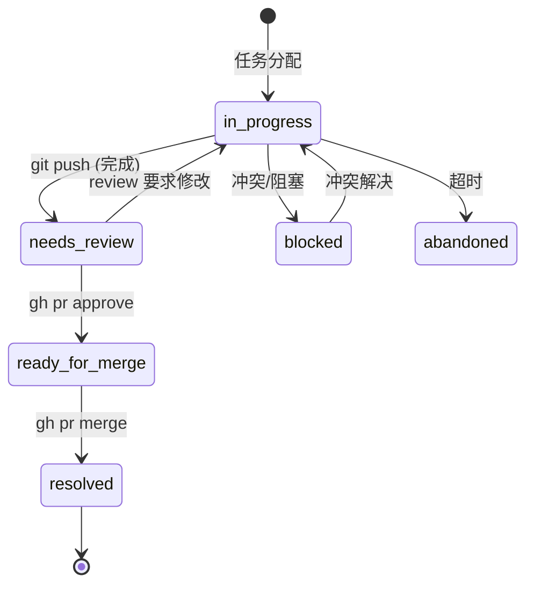

---
metadata:
  title: Git Coordination Specification
  version: 1.0.0
  component: ai-handover
  status: active
  valid_at: 2026-06-26
  provenance: "ai-handover v4.1 — Git 作为 AI 协作协调层"
  dependencies:
    - SKILL.md §5 (Git Trailers 协议)
    - SKILL.md §4 (Lane 状态机)
    - references/templates/lanes/state.md
---

# Git Coordination Specification

> **为 ai-handover v4.1 定义 Git 作为 AI Agent 协作协调层的完整规范。**
> 所有 AI agent（OpenCode、Claude Code、Codex CLI 等）必须遵守本规范。

---

## 目录

1. [Branch Strategy](#1-branch-strategy)
2. [Commit Trailers（IRON RULE #3）](#2-commit-trailersiron-rule-3)
3. [Agent Attribution](#3-agent-attribution)
4. [Handover-Id Association](#4-handover-id-association)
5. [Git Event → Lane State Mapping](#5-git-event--lane-state-mapping)
6. [Cross-Session Recovery Protocol](#6-cross-session-recovery-protocol)
7. [File Lock Handling（IRON RULE #6）](#7-file-lock-handlingiron-rule-6)
8. [Conflict Resolution](#8-conflict-resolution)
9. [Conventional Commits Integration](#9-conventional-commits-integration)
10. [Version & Changelog](#10-version--changelog)

---

## 1. Branch Strategy

### 1.1 Naming Convention

```
agent-<agent_id>/<type>-<description>
```

| 部分 | 格式 | 示例 |
|------|------|------|
| `agent_id` | `<agent_name>@<role>` | `coder@build`, `researcher@explore`, `scribe@docs` |
| `type` | 小写 kebab-case | `feat`, `fix`, `refactor`, `docs`, `test`, `chore`, `experiment` |
| `description` | 小写 kebab-case，2-5 词 | `session-timeout`, `cors-header`, `oidc-migration` |

**完整示例**：

```
agent-coder@build/feat-session-timeout
agent-coder2@codex/fix-cors
agent-researcher@explore/experiment-llm-compare
agent-scribe@docs/refactor-api-docs
agent-coder@build/chore-upgrade-deps
```

### 1.2 Branch Lifecycle

```
main ──► agent-xxx/feat-yyy ──► (work) ──► PR ──► squash merge ──► delete branch
  │                              │                      │
  │                         [agent commits]        [main updated]
  │                              │
  └── (other agents branch off newer main)
```

#### 详细流程

| 步骤 | 操作 | 责任方 | 验证点 |
|------|------|--------|--------|
| 1 | 从最新 `main` 创建分支 | orchestrator | `git merge-base --is-ancestor` |
| 2 | 在分支上工作、提交 | 分配的 agent | commit trailers 完整 |
| 3 | Push 分支 | 分配的 agent | push 成功 |
| 4 | 创建 PR | orchestrator / agent | PR 指向 main |
| 5 | Review + 门控检查 | reviewer / CI | trailers, lint, tests |
| 6 | Squash merge 到 main | orchestrator | 保留 Handover-Id trailer |
| 7 | 删除远程分支 | orchestrator | 清理完成 |

### 1.3 Write Permissions

| 分支 | 可写入 | 说明 |
|------|--------|------|
| `main` | 仅 orchestrator | 通过 squash merge 写入 |
| `agent-<自己>/<type>-<desc>` | 仅分配的 agent | 其他 agent 不得写入 |
| 第三方分支 | ❌ 禁止 | 发现则 revert + 通知 |

**规则**：agent 只能向自己的分支写代码。如需修改其他 agent 的分支，必须通过 orchestrator 协调。

### 1.4 Branch Lifecycle Diagram（Mermaid）


---

## 2. Commit Trailers（IRON RULE #3）

### 2.1 Required Trailers

每个 commit **必须包含**以下 trailers：

| Trailer | 是否必须 | 格式规则 | 示例 |
|---------|---------|---------|------|
| `Handover-Id` | ✅ **强制** | 值 = 交接记录目录名称（不含路径） | `Handover-Id: 2026-06-26_143052_user-auth` |
| `Coding-Agent` | ✅ **强制** | 值 = 工具名 + 版本 | `Coding-Agent: OpenCode v1.2.3` |
| `Model` | ✅ **强制** | 值 = 模型标识符 | `Model: claude-opus-4-6` |

### 2.2 Recommended Trailers

| Trailer | 优先级 | 格式规则 | 示例 |
|---------|--------|---------|------|
| `Constraint` | 🟡 推荐 | 逗号分隔的约束列表 | `Constraint: Python 3.8+, DRF>=3.14` |
| `Rejected-Alternatives` | 🟡 推荐 | 逗号分隔 | `Rejected-Alternatives: Redis->PostgreSQL, JWT->OAuth2` |
| `Agent-Directive` | 🟡 推荐 | 简短描述 | `Agent-Directive: 实现 session 超时自动退出` |
| `Verification` | 🟡 推荐 | 验证步骤 | `Verification: pytest tests/test_session.py -v passed` |
| `Confidence` | 🟡 推荐 | 百分比值 | `Confidence: 95%` |
| `Scope-Risk` | 🟡 推荐 | 范围 + 风险等级 | `Scope-Risk: auth_module, low` |

### 2.3 Format Rules

```
1. trailer 名称使用 Pascal-Case（首字母大写，连字符后大写）
2. trailer 值中冒号后必须跟一个空格
3. 多个 trailer 按此顺序排列：Handover-Id → Coding-Agent → Model → Constraint → Rejected-Alternatives → (其余推荐)
4. 值内禁止换行
5. 值内多个条目用逗号 + 空格分隔
6. 禁止使用 Unicode 控制字符
```

### 2.4 Good vs Bad Commits

**✅ 良好 commit**：

```
feat(auth): implement session timeout with auto-logout

Session 超过 30 分钟无操作自动退出。使用 JWT blacklist 方案。

Closes #142

Handover-Id: 2026-06-26_143052_user-auth
Coding-Agent: OpenCode v1.2.3
Model: claude-opus-4-6
Constraint: Python 3.8+, DRF>=3.14
Rejected-Alternatives: Redis->PostgreSQL
Agent-Directive: 实现 session 超时自动退出
Verification: pytest tests/test_session.py -v passed
Confidence: 95%
Scope-Risk: auth_module, low
```

**❌ 不良 commit**（缺失 trailers、格式错误）：

```
fix stuff

Handover-Id:2026-06-26_143052_user-auth
Co-authored-by: AI <ai@example.com>
```

问题：
- 缺少 `Coding-Agent` 和 `Model` trailer
- `Handover-Id` 冒号后缺空格
- 使用 `Co-authored-by` 而非标准 AI trailers
- 提交信息无意义

### 2.5 Enforcement

`validate.sh` 在 pre-commit 和 CI 中执行以下检查：

```bash
#!/usr/bin/env bash
# validate.sh — 校验 commit trailers 合规

COMMIT_MSG_FILE="${1:-/dev/stdin}"
errors=0

check_trailer() {
  if ! grep -q "^$1:" "$COMMIT_MSG_FILE"; then
    echo "❌ Missing required trailer: $1"
    errors=$((errors + 1))
  fi
}

# Required trailers
check_trailer "Handover-Id"
check_trailer "Coding-Agent"
check_trailer "Model"

# Format check: require space after colon
if grep -qP '^[A-Z][a-zA-Z-]+:[^ ]' "$COMMIT_MSG_FILE"; then
  echo "❌ Trailer format error: must have space after colon"
  errors=$((errors + 1))
fi

# Block Co-authored-by
if grep -q "^Co-authored-by:" "$COMMIT_MSG_FILE"; then
  echo "❌ Use Coding-Agent + Model instead of Co-authored-by"
  errors=$((errors + 1))
fi

exit $errors
```

**CI 集成**：将 `scripts/validate.sh` 加入 CI pipeline，PR 未通过则不可合并。

---

## 3. Agent Attribution

### 3.1 Coding-Agent 规范

`Coding-Agent` trailer 记录执行编码的 AI 工具身份：

| 工具 | 格式 | 示例 |
|------|------|------|
| OpenCode | `OpenCode v<semver>` | `OpenCode v1.2.3` |
| Claude Code | `Claude Code v<semver>` | `Claude Code v0.5.0` |
| Codex CLI | `Codex CLI v<semver>` | `Codex CLI v0.1.0` |
| Cursor | `Cursor <version>` | `Cursor 0.45.x` |
| GitHub Copilot | `GitHub Copilot <version>` | `GitHub Copilot 1.100.0` |
| 自定义 agent | `Custom: <name> v<semver>` | `Custom: internal-agent v2.1` |

### 3.2 Model 规范

`Model` trailer 记录执行编码时使用的模型：

| 模型 | 格式 |
|------|------|
| Claude | `claude-<model>-<version>`（如 `claude-opus-4-6`） |
| GPT | `gpt-<model>-<version>`（如 `gpt-4o-2024-08-06`） |
| Gemini | `gemini-<version>`（如 `gemini-2.0-flash`） |
| DeepSeek | `deepseek-<version>`（如 `deepseek-v3`） |
| GLM | `glm-<version>`（如 `glm-5.2`） |

### 3.3 为什么不用 Co-authored-by

| 问题 | 说明 |
|------|------|
| GitHub email 验证 | `Co-authored-by` 要求真实 email，AI 无合法 email |
| 归属混淆 | 将 AI 归类为"共同作者"是误导，AI 是工具而非协作者 |
| 统计污染 | Contribution graph 显示 AI 为 contributor，不准确 |
| 法律歧义 | 部分项目对 `Co-authored-by` 有法律归属解释 |

**正确做法**：始终使用 `Coding-Agent` + `Model` 替代 `Co-authored-by`。

### 3.4 完整示例

```
Coding-Agent: OpenCode v1.2.3
Model: claude-opus-4-6
```

```
Coding-Agent: Codex CLI v0.1.0
Model: gpt-4o-2024-08-06
```

---

## 4. Handover-Id Association

### 4.1 核心规则

**每个 commit 必须引用至少一个交接记录 ID**。

`Handover-Id` 的值 = `AI交接记录/` 下对应任务目录的名称（不含路径和时间前缀可缩写）。

### 4.2 查询命令

**查找特定 handover 的所有关联 commit**：

```bash
git log --grep="Handover-Id: 2026-06-26_143052_user-auth"
```

**批量列出所有含 Handover-Id 的 commit**：

```bash
git log --format="%H %s %(trailers:key=Handover-Id)"
```

**按 Coding-Agent 过滤**：

```bash
git log --grep="Coding-Agent: OpenCode"
```

**按 Model 过滤**：

```bash
git log --grep="Model: claude-opus-4-6"
```

**组合查询——某 handover 内某 agent 的所有 commit**：

```bash
git log --grep="Handover-Id: 2026-06-26_143052_user-auth" \
  --format="%H %s %(trailers:key=Coding-Agent) %(trailers:key=Model)"
```

### 4.3 自动化建议

将以下 alias 加入 `.gitconfig`：

```ini
[alias]
  handover = "!f() { git log --grep=\"Handover-Id: $1\" --format=\"%C(auto)%h %s %Cgreen%(trailers:key=Coding-Agent) %Cblue%(trailers:key=Model)\"; }; f"
  agents = "!f() { git log --grep=\"Coding-Agent: $1\" --format=\"%C(auto)%h %s %Cgreen%(trailers:key=Handover-Id)\"; }; f"
```

使用：

```bash
git handover 2026-06-26_143052_user-auth
git agents OpenCode
```

---

## 5. Git Event → Lane State Mapping

### 5.1 Lane States（见 ai-handover SKILL.md §4）

| 状态 | 含义 |
|------|------|
| `in-progress` | 正在执行 |
| `needs-review` | 等待 review |
| `ready-for-merge` | Review 通过，可合并 |
| `resolved` | 已完成 |
| `blocked` | 等待外部依赖 |
| `abandoned` | 已放弃 |

### 5.2 Event → State Transition Table

| Git 事件 | 前状态 | 后状态 | 条件 |
|---------|--------|--------|------|
| `git commit` | `in-progress` | `in-progress` | 无状态变更，仍在工作中 |
| `git push`（WIP） | `in-progress` | `in-progress` | 仅同步，未完成 |
| `git push`（含完成标记） | `in-progress` | `needs-review` | commit message 含 `Closes #` 或 `FIXES #` |
| `gh pr create` | `needs-review` | `needs-review` | 创建 PR 不改变 review 状态 |
| `gh pr review --approve` | `needs-review` | `ready-for-merge` | Review 通过 |
| `gh pr review --changes` | `needs-review` | `needs-review` | 要求修改，计数重置 |
| `gh pr merge`（squash） | `ready-for-merge` | `resolved` | 成功合并到 main |
| `git push --delete <branch>` | `resolved` | — | 分支清理完成 |
| 冲突阻塞 | `in-progress` | `blocked` | 检测到冲突 |
| 超时无响应 | `in-progress` | `abandoned` | >30min 无活动 |

### 5.3 状态机图示



---

## 6. Cross-Session Recovery Protocol

新 agent 进入项目时，按以下步骤恢复上下文：

### 6.1 标准恢复流程

```
Step 1: 读取 hot.md（当前关键状态）
Step 2: 读取索引（项目全景）
Step 3: 查看最近的 git 提交
Step 4: 查看活跃 handover 记录
Step 5: 检查文件锁
Step 6: 查看 lane 状态
Step 7: 检查待处理消息
```

### 6.2 逐步骤命令

**Step 1 — 当前关键状态**：

```bash
cat AI交接记录/wiki/hot.md
```

- 了解当前最重要的上下文

**Step 2 — 项目全景**：

```bash
cat AI交接记录/索引.md
```

- 了解所有交接记录、活跃 agent、项目结构

**Step 3 — 近期提交**：

```bash
git log --oneline -5
```

- 最近的代码变更

**Step 4 — 活跃 handover 记录**：

```bash
git log --grep="Handover-Id" --format="%H %s %(trailers:key=Handover-Id)" -10
```

- 当前正在进行的 handover 会话

**Step 5 — 文件锁检查**：

```bash
ls .ai-handover/locks/
```

或者

```bash
cat .ai-handover/locks/*.lock 2>/dev/null || echo "No active locks"
```

**Step 6 — Lane 状态**：

```bash
cat AI交接记录/lanes/active.md
```

- 每个工作 lane 的当前状态

**Step 7 — 待处理消息**：

```bash
cat AI交接记录/messages/inbox.jsonl
```

- 其他 agent 发来的未读消息

### 6.3 恢复完成检查清单

| 项目 | 已检查 |
|------|--------|
| hot.md — 当前关键状态 | ☐ |
| 索引.md — 项目全景 | ☐ |
| git log — 近期变更 | ☐ |
| Handover-Id — 活跃会话 | ☐ |
| 文件锁 — 冲突检测 | ☐ |
| lane 状态 — 工作流位置 | ☐ |
| inbox — 待处理消息 | ☐ |

---

## 7. File Lock Handling（IRON RULE #6）

### 7.1 Lock 文件格式

位于 `.ai-handover/locks/<module>/<filehash>.lock`：

```
agent: coder@build
file: src/auth/session.py
handover_id: 2026-06-26_143052_user-auth
acquired_at: 2026-06-26T14:30:52Z
ttl_minutes: 30
status: active
```

### 7.2 Lock 生命周期

```
agent 发现需要编辑文件
        │
        ▼
检查 .ai-handover/locks/<module>/ 下是否有锁
        │
   ┌────┴────┐
   │ 有锁     │ 无锁
   │         │
   ▼         ▼
检查是否   创建锁文件
过期(30min) 开始编辑
   │         │
   ├ 过期 →   │
   │ 强制释放  │
   │         │
   └ 未过期 → │
   等待/通知  │
             ▼
        编辑完成
             │
             ▼
        释放锁（删除锁文件）
```

### 7.3 命令速查

```bash
# 检查锁目录
ls .ai-handover/locks/

# 检查特定模块的锁
ls .ai-handover/locks/auth/

# 手动创建锁
mkdir -p .ai-handover/locks/auth

# 释放锁（编辑完成后）
rm -f .ai-handover/locks/auth/*.lock
```

### 7.4 死锁检测（Stale > 30min）

```bash
# 检测过期锁
for lockfile in $(find .ai-handover/locks -name '*.lock'); do
  acquired=$(head -5 "$lockfile" | grep acquired_at | cut -d' ' -f2)
  acquired_epoch=$(date -d "$acquired" +%s)
  now_epoch=$(date +%s)
  age_min=$(( (now_epoch - acquired_epoch) / 60 ))
  if [ $age_min -gt 30 ]; then
    echo "⚠️ STALE LOCK: $lockfile (${age_min}min old)"
    echo "  Contents:"
    cat "$lockfile"
    echo "  → Run: rm -f $lockfile"
  fi
done
```

**自动释放策略**：stale > 30min → orchestrator 自动释放并通知原 agent。

---

## 8. Conflict Resolution

### 8.1 重叠修改检测

以下情况视为文件冲突：

1. **Git merge conflict**：`git merge` 报告冲突
2. **文件锁冲突**：agent B 尝试编辑 agent A 锁定的文件
3. **逻辑冲突**：同一模块的上下游修改不一致

### 8.2 检测方法

```bash
# 方法 1：尝试合并
git merge agent-xxx/feat-yyy --no-commit 2>&1 | grep "CONFLICT"

# 方法 2：检查锁
ls .ai-handover/locks/$(dirname $file)

# 方法 3：git diff 交叉检查
git diff main...agent-xxx/feat-yyy -- $file
git diff main...agent-zzz/feat-www -- $file
```

### 8.3 优先级规则

| 角色 | 优先级 | 说明 |
|------|--------|------|
| orchestrator | 🥇 最高 | 可覆盖所有决策 |
| primary agent | 🥈 高 | 主 agent 的修改优先 |
| worker agent | 🥉 中 | 工作 agent 可提出建议 |
| reviewer | 咨询 | 无决策权 |

### 8.4 升级流程

```
检测到文件冲突
        │
        ▼
orchestrator 向冲突双方发送通知
        │
        ▼
     ┌──┴──┐
     │ 协商 │
     └──┬──┘
        │
   ┌────┴────┐
   │ 达成一致  │ 无法达成
   │         │
   ▼         ▼
 合并方案   orchestrator 裁决
   │         │
   ▼         ▼
 git merge  输出决策到 lanes/reviews.md
   │         │
   ▼         ▼
 update    通知双方执行
 handover
```

### 8.5 Rollback 操作

```bash
# 撤销上一次 squash merge
git revert -m 1 <merge_commit_hash>

# 记录到 handover
cat >> AI交接记录/索引.md << EOF
- Rollback: <merge_commit_hash>
  Reason: <冲突摘要>
  Resolution: <方案>
EOF
```

---

## 9. Conventional Commits Integration

### 9.1 Type → task_type 映射

| Conventional Commit Type | task_type | 说明 |
|-------------------------|-----------|------|
| `feat` | feature | 新功能 |
| `fix` | bugfix | 修复 bug |
| `refactor` | refactor | 重构（不改变功能） |
| `docs` | documentation | 仅文档变更 |
| `test` | testing | 测试相关 |
| `chore` | maintenance | 构建、依赖等杂项 |
| `perf` | performance | 性能优化 |
| `style` | cosmetic | 代码样式（格式化等） |
| `ci` | ci | CI 配置变更 |
| `revert` | rollback | 回退提交 |

### 9.2 Commit Message 结构

```
<type>(<scope>): <subject>

<body>

<footer>
```

| 部分 | 规则 | 示例 |
|------|------|------|
| `type` | 从 9.1 映射表选择 | `feat` |
| `scope` | 模块名（kebab-case） | `auth` |
| `subject` | 简短描述（<72 chars），结尾 `Closes #task_id` | `implement session timeout` |
| `body` | 详细说明（可选，中文/英文） | `Session 超时自动退出机制...` |
| `footer` | Trailers + issues | `Closes #142` |

### 9.3 完整示例

```
feat(auth): implement session timeout with auto-logout

Session 超过 30 分钟无操作自动退出。使用 JWT blacklist 方案。

Closes #142

Handover-Id: 2026-06-26_143052_user-auth
Coding-Agent: OpenCode v1.2.3
Model: claude-opus-4-6
Constraint: Python 3.8+, DRF>=3.14
Rejected-Alternatives: Redis->PostgreSQL
Agent-Directive: 实现 session 超时自动退出
Verification: pytest tests/test_session.py -v passed
Confidence: 95%
Scope-Risk: auth_module, low
```

---

## 10. Version & Changelog

| Version | Date | Author | Changes |
|---------|------|--------|---------|
| 1.0.0 | 2026-06-26 | ai-handover v4.1 | 初始版本：分支策略、Trailers 规范、Agent 归属、Handover-Id 关联、Lane 映射、恢复协议、文件锁、冲突解决、Conventional Commits 集成 |

---

*本规范是 ai-handover v4.1 的组成部分，与 `SKILL.md` §4 Lane 状态机 和 §5 Git Trailers 协议 配合使用。*
